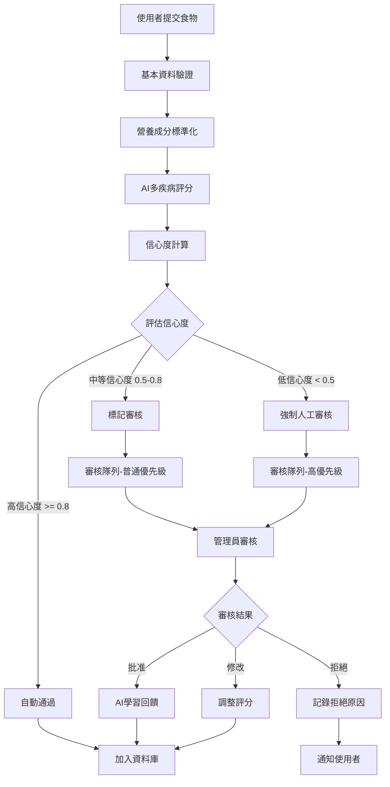

# AI驅動食物評估工作流程設計

## 概述

設計智能化食物評估系統，結合AI自動評分與管理員驗證，確保多疾病個人化評分的準確性與可靠性。

## 核心工作流程

### 1. 自訂食物提交流程



### 2. AI評分管線

#### Step 1: 資料預處理
```typescript
interface FoodSubmission {
  name: string
  category: string
  nutrition: FoodNutritionData
  cooking_methods: string[]
  ingredients?: string[]
  allergen_info?: string[]
  user_notes?: string
}

class FoodPreprocessor {
  static standardizeNutrition(nutrition: any): FoodNutritionData {
    // 標準化營養成分格式
    // 處理不同單位換算
    // 補充缺失的營養資料
  }

  static extractFoodProperties(submission: FoodSubmission): FoodProperties {
    // 從食物名稱和描述推斷屬性
    // 分析烹飪方式對營養的影響
    // 識別食物質地和加工程度
  }

  static detectPotentialAllergens(
    name: string,
    ingredients: string[]
  ): string[] {
    // 基於成分清單識別過敏原
    // 檢查隱藏的過敏原成分
    // 分析交叉污染風險
  }
}
```

#### Step 2: 多疾病AI評分引擎

```typescript
interface AIEvaluationResult {
  scores: MultiConditionScores
  confidence: ConditionConfidence
  reasoning: ConditionReasoning
  flags: EvaluationFlags
  review_required: boolean
  review_priority: 'low' | 'medium' | 'high'
}

interface ConditionConfidence {
  ibd: number
  ibs: number
  cancer_chemo: number
  allergies: number
  overall: number
}

interface ConditionReasoning {
  ibd: ReasoningPoint[]
  ibs: ReasoningPoint[]
  cancer_chemo: ReasoningPoint[]
  allergies: ReasoningPoint[]
}

interface ReasoningPoint {
  factor: string
  impact: 'positive' | 'negative' | 'neutral'
  weight: number
  explanation: string
}

class MultiConditionAIEngine {
  static async evaluateFood(
    food: FoodSubmission
  ): Promise<AIEvaluationResult> {
    const preprocessed = FoodPreprocessor.standardizeNutrition(food.nutrition)
    const properties = FoodPreprocessor.extractFoodProperties(food)

    // 並行評估所有疾病條件
    const [ibdResult, ibsResult, chemoResult, allergyResult] = await Promise.all([
      this.evaluateIBD(preprocessed, properties),
      this.evaluateIBS(preprocessed, properties),
      this.evaluateCancerChemo(preprocessed, properties),
      this.evaluateAllergies(food.allergen_info || [], properties)
    ])

    // 整合評估結果
    return this.aggregateResults(ibdResult, ibsResult, chemoResult, allergyResult)
  }

  private static async evaluateIBD(
    nutrition: FoodNutritionData,
    properties: FoodProperties
  ): Promise<ConditionEvaluationResult> {
    const reasoning: ReasoningPoint[] = []
    let acuteScore = 3 // 基準分數
    let remissionScore = 3
    let confidence = 0.7

    // 纖維含量分析
    if (nutrition.fiber > 3) {
      acuteScore -= 2
      remissionScore -= 1
      reasoning.push({
        factor: '高纖維含量',
        impact: 'negative',
        weight: 0.8,
        explanation: `纖維含量${nutrition.fiber}g，對IBD急性期風險較高`
      })
      confidence += 0.1
    }

    // 烹飪方式分析
    if (properties.cooking_methods.includes('fried')) {
      acuteScore -= 1.5
      remissionScore -= 1
      reasoning.push({
        factor: '油炸烹調',
        impact: 'negative',
        weight: 0.6,
        explanation: '油炸食物較難消化，可能引發炎症反應'
      })
      confidence += 0.1
    }

    if (properties.cooking_methods.includes('steamed')) {
      acuteScore += 1
      remissionScore += 0.5
      reasoning.push({
        factor: '蒸煮烹調',
        impact: 'positive',
        weight: 0.7,
        explanation: '蒸煮方式溫和，易於消化'
      })
      confidence += 0.1
    }

    // 辛辣程度分析
    if (properties.spice_level !== 'none') {
      const spiceImpact = this.getSpiceImpact(properties.spice_level)
      acuteScore -= spiceImpact.acute
      remissionScore -= spiceImpact.remission
      reasoning.push({
        factor: '辛辣程度',
        impact: 'negative',
        weight: spiceImpact.weight,
        explanation: `${properties.spice_level}辛辣度可能刺激腸道`
      })
    }

    return {
      scores: {
        acute_phase: Math.max(0, Math.min(5, Math.round(acuteScore))),
        remission_phase: Math.max(0, Math.min(5, Math.round(remissionScore))),
        general_safety: Math.round((acuteScore + remissionScore) / 2)
      },
      confidence: Math.min(0.95, confidence),
      reasoning
    }
  }

  private static async evaluateIBS(
    nutrition: FoodNutritionData,
    properties: FoodProperties
  ): Promise<ConditionEvaluationResult> {
    const reasoning: ReasoningPoint[] = []
    let score = 3
    let confidence = 0.6

    // FODMAP分析
    const fodmapLevel = this.estimateFODMAPLevel(nutrition, properties)
    switch (fodmapLevel) {
      case 'high':
        score -= 2
        reasoning.push({
          factor: 'FODMAP含量',
          impact: 'negative',
          weight: 0.9,
          explanation: '高FODMAP食物容易引發IBS症狀'
        })
        confidence += 0.2
        break
      case 'low':
        score += 1
        reasoning.push({
          factor: 'FODMAP含量',
          impact: 'positive',
          weight: 0.8,
          explanation: '低FODMAP食物對IBS患者較安全'
        })
        confidence += 0.2
        break
    }

    // 脂肪含量分析
    if (nutrition.fat > 15) {
      score -= 1
      reasoning.push({
        factor: '高脂肪含量',
        impact: 'negative',
        weight: 0.6,
        explanation: `脂肪含量${nutrition.fat}g，可能引發腹瀉症狀`
      })
      confidence += 0.1
    }

    return {
      scores: {
        general_safety: Math.max(0, Math.min(5, Math.round(score))),
        fodmap_level: fodmapLevel,
        trigger_risk: this.calculateTriggerRisk(score)
      },
      confidence: Math.min(0.9, confidence),
      reasoning
    }
  }

  private static async evaluateCancerChemo(
    nutrition: FoodNutritionData,
    properties: FoodProperties
  ): Promise<ConditionEvaluationResult> {
    const reasoning: ReasoningPoint[] = []
    let safetyScore = 3
    let immuneScore = 3
    let nauseaScore = 3
    let nutritionScore = 3
    let confidence = 0.6

    // 營養密度分析
    const nutritionDensity = this.calculateNutritionDensity(nutrition)
    if (nutritionDensity > 2) {
      nutritionScore += 1.5
      immuneScore += 1
      reasoning.push({
        factor: '高營養密度',
        impact: 'positive',
        weight: 0.8,
        explanation: '高營養密度有助於化療期間體力恢復'
      })
      confidence += 0.1
    }

    // 質地與消化性分析
    if (properties.texture === 'very_soft' || properties.texture === 'liquid') {
      nauseaScore += 1.5
      safetyScore += 1
      reasoning.push({
        factor: '軟質質地',
        impact: 'positive',
        weight: 0.7,
        explanation: '軟質食物較不易引發噁心感'
      })
      confidence += 0.1
    }

    // 生食風險分析
    if (properties.cooking_methods.includes('raw')) {
      safetyScore -= 2
      reasoning.push({
        factor: '生食風險',
        impact: 'negative',
        weight: 0.9,
        explanation: '化療期間免疫力低下，生食感染風險高'
      })
      confidence += 0.2
    }

    // 抗氧化成分分析
    const antioxidantLevel = this.estimateAntioxidantLevel(nutrition, properties)
    if (antioxidantLevel > 0.7) {
      immuneScore += 1
      reasoning.push({
        factor: '抗氧化成分',
        impact: 'positive',
        weight: 0.6,
        explanation: '富含抗氧化成分，有助於細胞修復'
      })
    }

    return {
      scores: {
        general_safety: Math.max(0, Math.min(5, Math.round(safetyScore))),
        immune_support: Math.max(0, Math.min(5, Math.round(immuneScore))),
        nausea_friendly: Math.max(0, Math.min(5, Math.round(nauseaScore))),
        nutrition_density: Math.max(0, Math.min(5, Math.round(nutritionScore)))
      },
      confidence: Math.min(0.85, confidence),
      reasoning
    }
  }
}
```

#### Step 3: 信心度評估與決策邏輯

```typescript
class ConfidenceEvaluator {
  static calculateOverallConfidence(
    conditionConfidences: ConditionConfidence,
    foodComplexity: number,
    dataCompleteness: number
  ): number {
    // 基礎信心度為各疾病條件信心度的加權平均
    const baseConfidence = (
      conditionConfidences.ibd * 0.3 +
      conditionConfidences.ibs * 0.25 +
      conditionConfidences.cancer_chemo * 0.25 +
      conditionConfidences.allergies * 0.2
    )

    // 根據食物複雜度調整
    const complexityAdjustment = 1 - (foodComplexity * 0.2)

    // 根據資料完整度調整
    const completenessAdjustment = dataCompleteness

    return Math.max(0.1, Math.min(0.95,
      baseConfidence * complexityAdjustment * completenessAdjustment
    ))
  }

  static determineReviewRequired(
    confidence: number,
    scores: MultiConditionScores
  ): { required: boolean; priority: string; reasons: string[] } {
    const reasons: string[] = []
    let required = false
    let priority = 'low'

    // 低信心度需要審核
    if (confidence < 0.5) {
      required = true
      priority = 'high'
      reasons.push('AI評分信心度過低')
    } else if (confidence < 0.8) {
      required = true
      priority = 'medium'
      reasons.push('AI評分信心度中等，建議人工確認')
    }

    // 極端分數需要審核
    const allScores = this.flattenScores(scores)
    if (allScores.some(score => score <= 1)) {
      required = true
      priority = 'high'
      reasons.push('檢測到極低分數，需確認安全性')
    }

    // 疾病間評分差異過大需要審核
    const scoreVariance = this.calculateScoreVariance(allScores)
    if (scoreVariance > 2) {
      required = true
      priority = 'medium'
      reasons.push('不同疾病條件評分差異過大')
    }

    return { required, priority, reasons }
  }
}
```

### 3. 管理員審核系統

#### 審核介面設計

```typescript
interface AdminReviewDashboard {
  // 待審核統計
  pending_count: number
  high_priority_count: number
  average_review_time: number

  // 審核隊列
  review_queue: AdminReviewItem[]

  // AI效能指標
  ai_accuracy: {
    last_week: number
    last_month: number
    trending: 'up' | 'down' | 'stable'
  }

  // 快速操作
  quick_actions: {
    batch_approve_high_confidence: () => void
    reject_obvious_spam: () => void
    prioritize_allergy_foods: () => void
  }
}

interface AdminReviewItem {
  id: string
  food_data: FoodSubmission
  ai_evaluation: AIEvaluationResult
  submission_info: {
    user_id: string
    submitted_at: string
    user_reputation: number
  }
  similar_foods: SimilarFood[]
  flags: ReviewFlag[]
}

interface ReviewFlag {
  type: 'low_confidence' | 'extreme_score' | 'potential_spam' | 'missing_data'
  severity: 'info' | 'warning' | 'critical'
  description: string
}

class AdminReviewService {
  static async getReviewQueue(
    adminId: string,
    filters?: ReviewFilters
  ): Promise<AdminReviewItem[]> {
    // 獲取待審核項目，支援篩選和排序
  }

  static async reviewFood(
    foodId: string,
    adminId: string,
    decision: ReviewDecision
  ): Promise<void> {
    // 處理審核決定
    // 更新AI學習資料
    // 通知使用者結果
  }

  static async batchReview(
    foodIds: string[],
    adminId: string,
    decision: BatchReviewDecision
  ): Promise<BatchReviewResult> {
    // 批量審核處理
  }
}
```

#### 審核工作流程最佳化

```typescript
class ReviewWorkflowOptimizer {
  // 智能優先級排序
  static prioritizeReviewItems(items: AdminReviewItem[]): AdminReviewItem[] {
    return items.sort((a, b) => {
      // 優先級因子權重
      const weights = {
        confidence: 0.3,
        user_reputation: 0.2,
        food_risk: 0.3,
        waiting_time: 0.2
      }

      const scoreA = this.calculatePriorityScore(a, weights)
      const scoreB = this.calculatePriorityScore(b, weights)

      return scoreB - scoreA // 高分優先
    })
  }

  // 預測審核時間
  static estimateReviewTime(item: AdminReviewItem): number {
    const factors = {
      complexity: this.assessFoodComplexity(item.food_data),
      ai_confidence: item.ai_evaluation.confidence.overall,
      data_completeness: this.assessDataCompleteness(item.food_data)
    }

    // 基於歷史資料的時間預測模型
    return this.timeEstimationModel(factors)
  }

  // 自動化簡單審核
  static identifyAutoApprovableFoods(
    items: AdminReviewItem[]
  ): { auto_approve: string[]; requires_review: AdminReviewItem[] } {
    const auto_approve: string[] = []
    const requires_review: AdminReviewItem[] = []

    items.forEach(item => {
      if (
        item.ai_evaluation.confidence.overall >= 0.9 &&
        item.submission_info.user_reputation >= 0.8 &&
        !item.flags.some(flag => flag.severity === 'critical')
      ) {
        auto_approve.push(item.id)
      } else {
        requires_review.push(item)
      }
    })

    return { auto_approve, requires_review }
  }
}
```

### 4. AI學習與改進機制

#### 反饋學習系統

```typescript
interface LearningFeedback {
  food_id: string
  ai_prediction: AIEvaluationResult
  admin_decision: ReviewDecision
  feedback_type: 'approval' | 'modification' | 'rejection'
  correction_details?: ScoreCorrection[]
}

interface ScoreCorrection {
  condition: string
  original_score: number
  corrected_score: number
  correction_reason: string
}

class AILearningEngine {
  static async processFeedback(feedback: LearningFeedback): Promise<void> {
    // 分析AI預測與人工決定的差異
    const discrepancy = this.analyzeDiscrepancy(
      feedback.ai_prediction,
      feedback.admin_decision
    )

    // 更新評分模型權重
    if (discrepancy.significance > 0.3) {
      await this.updateScoringWeights(discrepancy)
    }

    // 更新信心度模型
    await this.updateConfidenceModel(feedback)

    // 記錄學習案例
    await this.storeLearningCase(feedback, discrepancy)
  }

  static async generatePerformanceReport(): Promise<AIPerformanceReport> {
    return {
      accuracy_trends: await this.calculateAccuracyTrends(),
      common_error_patterns: await this.identifyErrorPatterns(),
      improvement_suggestions: await this.generateImprovementSuggestions(),
      model_drift_analysis: await this.analyzeModelDrift()
    }
  }

  private static async updateScoringWeights(
    discrepancy: DiscrepancyAnalysis
  ): Promise<void> {
    // 根據人工糾正調整評分權重
    // 例如：如果AI經常低估纖維影響，增加纖維權重
  }

  private static async updateConfidenceModel(
    feedback: LearningFeedback
  ): Promise<void> {
    // 基於審核結果調整信心度計算
    // 提高準確預測的信心度權重
  }
}
```

### 5. 品質保證機制

#### 多層驗證系統

```typescript
class QualityAssurance {
  // 資料一致性檢查
  static validateDataConsistency(food: FoodSubmission): ValidationResult {
    const issues: ValidationIssue[] = []

    // 營養成分合理性檢查
    if (food.nutrition.protein + food.nutrition.carbohydrates + food.nutrition.fat > 120) {
      issues.push({
        type: 'nutrition_sum_invalid',
        severity: 'error',
        message: '三大營養素總和超過100g，請檢查資料'
      })
    }

    // 分類與營養成分一致性
    if (food.category === '水果' && food.nutrition.protein > 10) {
      issues.push({
        type: 'category_nutrition_mismatch',
        severity: 'warning',
        message: '水果類食物蛋白質含量異常偏高'
      })
    }

    return { valid: issues.length === 0, issues }
  }

  // 重複食物檢測
  static async detectDuplicates(
    food: FoodSubmission
  ): Promise<DuplicateDetectionResult> {
    const similarFoods = await this.findSimilarFoods(food)

    const duplicates = similarFoods.filter(similar =>
      this.calculateSimilarity(food, similar) > 0.9
    )

    return {
      has_duplicates: duplicates.length > 0,
      duplicate_foods: duplicates,
      similarity_threshold: 0.9
    }
  }

  // 異常值檢測
  static detectAnomalies(scores: MultiConditionScores): AnomalyResult {
    const anomalies: Anomaly[] = []

    // 檢測分數分佈異常
    const allScores = this.flattenScores(scores)
    const variance = this.calculateVariance(allScores)

    if (variance > 3) {
      anomalies.push({
        type: 'high_score_variance',
        description: '不同疾病條件評分差異過大',
        severity: 'warning'
      })
    }

    return { has_anomalies: anomalies.length > 0, anomalies }
  }
}
```

### 6. 效能監控與優化

#### 系統效能指標

```typescript
interface PerformanceMetrics {
  evaluation_time: {
    average: number
    p95: number
    p99: number
  }

  accuracy_metrics: {
    overall: number
    by_condition: Record<string, number>
    trending: 'improving' | 'stable' | 'declining'
  }

  review_metrics: {
    pending_count: number
    average_review_time: number
    auto_approval_rate: number
  }

  system_load: {
    cpu_usage: number
    memory_usage: number
    api_response_time: number
  }
}

class PerformanceMonitor {
  static async collectMetrics(): Promise<PerformanceMetrics> {
    return {
      evaluation_time: await this.measureEvaluationTime(),
      accuracy_metrics: await this.calculateAccuracyMetrics(),
      review_metrics: await this.getReviewMetrics(),
      system_load: await this.getSystemLoad()
    }
  }

  static async optimizePerformance(): Promise<OptimizationResult> {
    const metrics = await this.collectMetrics()
    const optimizations: Optimization[] = []

    // AI評分性能優化
    if (metrics.evaluation_time.average > 5000) {
      optimizations.push({
        type: 'cache_common_evaluations',
        description: '快取常見食物評分結果',
        expected_improvement: '50% 評分時間減少'
      })
    }

    // 資料庫查詢優化
    if (metrics.system_load.api_response_time > 2000) {
      optimizations.push({
        type: 'optimize_database_indexes',
        description: '優化資料庫索引',
        expected_improvement: '30% 查詢速度提升'
      })
    }

    return { optimizations, estimated_impact: this.calculateImpact(optimizations) }
  }
}
```

## 實作時程

### Week 1-2: 核心AI評分引擎
- [ ] 多疾病評分邏輯實作
- [ ] 信心度計算系統
- [ ] 基本審核工作流程

### Week 3-4: 管理員審核系統
- [ ] 審核介面開發
- [ ] 批量操作功能
- [ ] 效能監控儀表板

### Week 5-6: AI學習與最佳化
- [ ] 反饋學習機制
- [ ] 品質保證系統
- [ ] 效能最佳化

### Week 7-8: 整合測試與部署
- [ ] 端對端測試
- [ ] 效能測試
- [ ] 生產環境部署

這個AI評估工作流程設計提供了完整的自動化與人工審核平衡機制，確保食物評分的準確性同時提高系統效率。