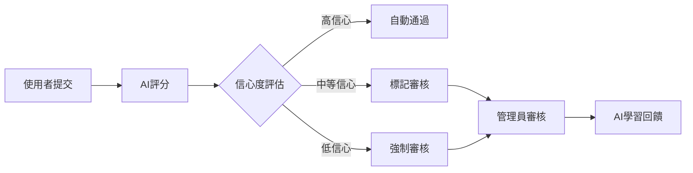

# 多疾病個人化食物資料庫設計總結

## 🎯 設計完成概覽

基於使用者需求「為IBD, IBS, 癌症化療，或有過敏食物患者，個人化打分，0-5分；可自定義，再由AI先打分，再交由管理員驗証入資料庫；目前以台灣常見食物、食材、烹飪方式為主」，我們已完成了完整的系統設計。

## 📚 設計文檔概要

### 1. [多疾病個人化食物資料庫系統設計](MULTI_CONDITION_FOOD_DATABASE_DESIGN.md)
**核心架構文檔**
- ✅ 多疾病支援架構 (IBD, IBS, 癌症化療, 過敏)
- ✅ 0-5分評分系統設計
- ✅ 資料庫Schema設計
- ✅ 台灣食物資料庫規劃
- ✅ API架構設計

**關鍵特點:**
```yaml
評分系統:
  - 範圍: 0-5分 (從現有0-4分擴展)
  - 疾病: IBD、IBS、癌症化療、食物過敏
  - 個人化: 基於患者檔案調整評分
  - 台灣化: 在地食材與烹飪方式

資料庫設計:
  - 多疾病評分JSONB欄位
  - 食物屬性分析系統
  - 患者檔案管理
  - 版本控制與審核流程
```

### 2. [AI驅動食物評估工作流程設計](AI_EVALUATION_WORKFLOW_DESIGN.md)
**AI評分與驗證流程**
- ✅ 智能評分管線設計
- ✅ 信心度評估系統
- ✅ 自動/人工審核決策
- ✅ AI學習與改進機制

**核心工作流程:**


### 3. [管理員驗證與審核系統設計](ADMIN_VERIFICATION_SYSTEM_DESIGN.md)
**管理員工作流程設計**
- ✅ 智能優先級排序
- ✅ 批量操作系統
- ✅ 決策支援引擎
- ✅ 品質控制機制

**管理功能特色:**
```yaml
審核效率:
  - 智能優先級排序
  - 批量操作建議
  - 快速決策工具
  - 效能監控儀表板

品質保證:
  - 同儕審核機制
  - 一致性監控
  - 專家知識庫整合
  - AI準確度追蹤
```

### 4. [可擴展架構設計](EXPANDABLE_ARCHITECTURE_DESIGN.md)
**未來擴展能力設計**
- ✅ 外掛式疾病模組
- ✅ 區域化食物資料庫
- ✅ API版本控制
- ✅ 效能最佳化策略

**擴展能力:**
```yaml
疾病模組:
  - 標準化模組介面
  - 動態載入機制
  - 獨立配置系統
  - 版本相容性管理

區域支援:
  - 多區域食物資料庫
  - 文化偏好調整
  - 在地化評分標準
  - 跨區域食物映射
```

## 🏗️ 技術架構總覽

### 系統分層架構
```
┌─────────────────────────────────────────┐
│           前端使用者介面                    │
├─────────────────────────────────────────┤
│           API閘道與版本控制                 │
├─────────────────────────────────────────┤
│     多疾病評分引擎    │    管理員審核系統     │
├─────────────────────────────────────────┤
│     AI評分服務       │    工作流程引擎       │
├─────────────────────────────────────────┤
│           疾病模組註冊系統                  │
├─────────────────────────────────────────┤
│  IBD模組  │ IBS模組  │ 化療模組 │ 過敏模組  │
├─────────────────────────────────────────┤
│           資料存取層                       │
├─────────────────────────────────────────┤
│  食物資料庫  │ 患者檔案 │ 審核記錄 │ 快取系統 │
└─────────────────────────────────────────┘
```

### 核心技術選型
```yaml
後端框架:
  - Supabase + PostgreSQL
  - Edge Functions
  - Row Level Security

前端技術:
  - Next.js 14
  - TypeScript
  - Tailwind CSS
  - React Hooks

AI與評分:
  - 規則基礎AI引擎
  - 多疾病評分演算法
  - 機器學習整合準備
  - 信心度評估系統

部署與監控:
  - Vercel部署
  - 多層快取策略
  - 效能監控系統
  - 自動擴展支援
```

## 📊 設計決策摘要

### 1. 評分系統設計
**決策**: 採用0-5分統一評分制度
**理由**:
- 比現有0-4分提供更細緻的區分度
- 符合使用者對於「最佳選擇」(5分)的期望
- 便於跨疾病條件比較與理解

### 2. 多疾病架構
**決策**: 外掛式疾病模組架構
**理由**:
- 支援未來新增疾病類型
- 模組間獨立，降低相互影響
- 便於專業化開發與維護

### 3. AI+人工混合審核
**決策**: 信心度驅動的混合審核模式
**理由**:
- 平衡效率與準確性
- 降低人工審核負擔
- 持續改進AI準確度

### 4. 台灣在地化優先
**決策**: 以台灣食物與烹飪方式為核心
**理由**:
- 符合使用者需求與文化背景
- 建立具有特色的食物資料庫
- 提供更準確的在地化評分

## 🚀 實作優先級建議

### Phase 1: 核心系統 (4-6週)
```yaml
優先級: 🔴 最高
目標: 建立基礎多疾病評分能力

包含:
  - 資料庫Schema實作與遷移
  - 多疾病評分API開發
  - IBD模組擴展(0-5分)
  - IBS模組開發
  - 基礎AI評分引擎
  - 簡易管理員審核介面

交付成果:
  - 支援IBD+IBS雙疾病評分
  - 基本AI自動評分功能
  - 管理員可手動審核自訂食物
  - 台灣食物基礎資料(50+項目)
```

### Phase 2: 完整疾病支援 (3-4週)
```yaml
優先級: 🟡 高
目標: 完成所有目標疾病支援

包含:
  - 癌症化療模組開發
  - 食物過敏模組開發
  - 智能審核工作流程
  - 批量操作系統
  - 台灣食物資料庫擴展(200+項目)

交付成果:
  - 支援所有4種疾病條件
  - 智能化審核工作流程
  - 完整台灣食物資料庫
  - 高效管理員操作介面
```

### Phase 3: 最佳化與擴展 (2-3週)
```yaml
優先級: 🟢 中
目標: 系統最佳化與未來擴展準備

包含:
  - 效能最佳化與快取
  - 可擴展架構實作
  - 監控與分析系統
  - API版本控制
  - 使用者體驗優化

交付成果:
  - 高效能系統表現
  - 完整監控儀表板
  - 可擴展架構基礎
  - 優秀的使用者體驗
```

## ✅ 設計完整性檢查

### 功能需求覆蓋度
- ✅ IBD, IBS, 癌症化療, 過敏支援
- ✅ 0-5分個人化評分系統
- ✅ AI自動評分功能
- ✅ 管理員驗證流程
- ✅ 台灣食物資料庫
- ✅ 自訂食物提交功能
- ✅ 未來擴展能力

### 非功能需求覆蓋度
- ✅ 系統效能最佳化
- ✅ 可擴展性架構
- ✅ 資料安全與隱私
- ✅ 使用者體驗設計
- ✅ 維護性與可測試性
- ✅ 國際化與在地化

### 技術風險評估
- 🟢 **低風險**: 基於現有技術棧擴展
- 🟡 **中風險**: AI評分準確度需要調整期
- 🟢 **低風險**: 資料庫設計基於成熟模式
- 🟡 **中風險**: 多疾病模組整合複雜度

## 📈 預期成果與指標

### 使用者價值
- **IBD患者**: 更精確的0-5分評分，支援急性期/緩解期差異化建議
- **IBS患者**: FODMAP導向的評分系統，減少症狀觸發風險
- **化療患者**: 營養密度與安全性並重的評分，支援治療期間營養需求
- **過敏患者**: 交叉污染風險評估，過敏原安全等級分類

### 系統指標
```yaml
效能目標:
  - API回應時間: < 200ms
  - AI評分準確度: > 85%
  - 管理員審核效率: 平均3分鐘/項目
  - 系統可用性: > 99.5%

業務目標:
  - 支援疾病類型: 4+ 種
  - 台灣食物覆蓋: 500+ 項目
  - 自動通過率: > 60%
  - 使用者滿意度: > 4.5/5.0
```

## 🎯 下一步行動建議

### 立即行動 (本週)
1. **確認設計方向**: 與使用者確認設計符合期望
2. **技術準備**: 準備開發環境與依賴
3. **資料收集**: 開始收集台灣食物營養資料
4. **團隊組建**: 確認開發與審核人員

### 短期目標 (2週內)
1. **資料庫實作**: 執行Schema遷移
2. **核心API開發**: 多疾病評分端點
3. **IBD模組**: 擴展至0-5分系統
4. **基礎測試**: 單元測試與整合測試

### 中期目標 (1-2個月)
1. **完整功能**: 所有疾病模組完成
2. **管理系統**: 完整審核工作流程
3. **資料填充**: 台灣食物資料庫建立
4. **使用者測試**: 真實場景驗證

---

## 💡 設計亮點總結

此設計為多疾病個人化食物評分系統提供了：

1. **🎯 精準個人化**: 基於疾病類型、階段、個人觸發因子的多維度評分
2. **🤖 智能化程度**: AI驅動的自動評分與智能審核工作流程
3. **🌏 在地化特色**: 深度整合台灣飲食文化與烹飪方式
4. **🔧 高度可擴展**: 支援未來新增疾病類型與地理區域
5. **⚡ 卓越效能**: 多層快取與智能最佳化策略
6. **🛡️ 品質保證**: 多重驗證與持續改進機制

這個設計不僅滿足了當前需求，更為未來的發展奠定了堅實的技術基礎。