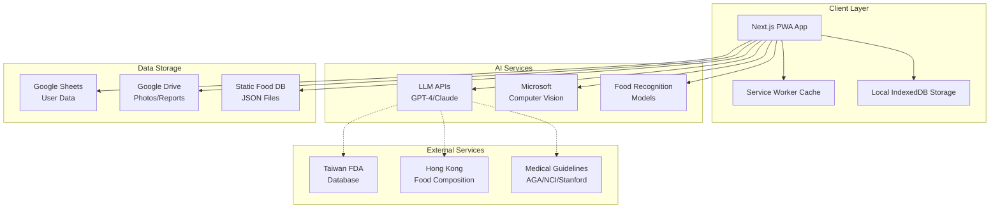
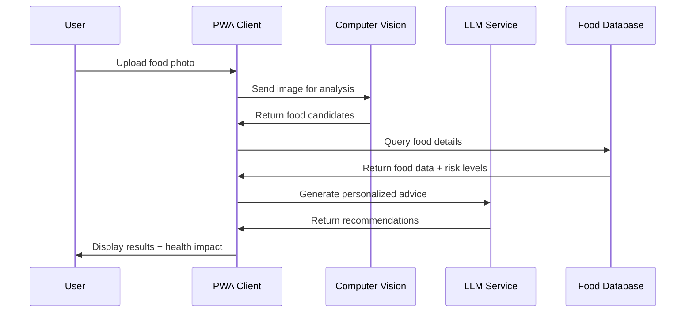
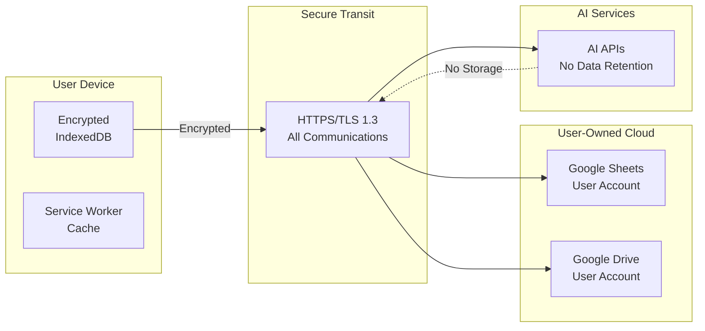

# Diet Daily - System Architecture Design

## 🎯 System Overview

**Application Type**: Progressive Web App (PWA)
**Target Platform**: Web-first with mobile compatibility
**Architecture Pattern**: Client-side focused with cloud services integration
**Primary Users**: IBD, 化療, 過敏源, IBS patients in Taiwan/Hong Kong

---

## 🏗️ System Architecture Diagram



---

## 📱 Application Architecture

### Frontend Architecture (Next.js PWA)

```typescript
// Application Structure
src/
├── app/                    // Next.js 13+ App Router
│   ├── (dashboard)/        // Dashboard layout group
│   │   ├── food-log/       // Food logging interface
│   │   ├── health-track/   // 4-level health tracking
│   │   └── medical-report/ // Doctor consultation reports
│   ├── api/               // API routes for server functions
│   │   ├── ai-classify/   // Food classification endpoint
│   │   ├── generate-report/ // Medical report generation
│   │   └── sheets/        // Google Sheets integration
│   └── globals.css        // Global styles
├── components/            // Reusable UI components
│   ├── ui/               // Base UI components
│   ├── food/             // Food-related components
│   ├── health/           // Health tracking components
│   └── medical/          // Medical report components
├── lib/                  // Utility libraries
│   ├── ai/              // AI service integrations
│   ├── database/        // Data management
│   ├── medical/         // Medical algorithms
│   └── sheets/          // Google Sheets API
├── data/                // Static data files
│   └── foods/           // AI-generated food database
└── types/               // TypeScript type definitions
```

### Core Data Models

```typescript
// Primary Data Interfaces
interface User {
  id: string;
  profile: {
    name: string;
    condition: 'IBD' | '化療' | '過敏源' | 'IBS';
    allergies: string[];
    preferences: UserPreferences;
  };
  settings: {
    language: 'zh-TW' | 'en';
    notifications: boolean;
    privacy: PrivacySettings;
  };
}

interface FoodEntry {
  id: string;
  userId: string;
  timestamp: Date;
  food: {
    name_zh: string;
    name_en: string;
    category: FoodCategory;
    confidence: number; // AI recognition confidence
  };
  photo?: string; // Google Drive URL
  healthRating: 1 | 2 | 3 | 4; // 差/普通/好/完美
  symptoms?: string[];
  notes?: string;
}

interface HealthTracking {
  date: Date;
  userId: string;
  overallHealth: 1 | 2 | 3 | 4;
  mood: 1 | 2 | 3 | 4;
  symptoms: {
    type: string;
    severity: 1 | 2 | 3 | 4;
  }[];
  medication?: {
    taken: boolean;
    timing: string;
    notes?: string;
  };
}

interface MedicalReport {
  id: string;
  userId: string;
  period: {
    start: Date;
    end: Date;
  };
  generated: Date;
  summary: {
    averageHealth: number;
    trend: 'improving' | 'stable' | 'declining';
    totalEntries: number;
  };
  analysis: {
    highRiskFoods: FoodRisk[];
    safeFoods: string[];
    patterns: HealthPattern[];
    recommendations: string[];
  };
  reportUrl: string; // Google Drive PDF
}
```

---

## 🤖 AI Integration Architecture

### AI Services Pipeline



### AI Service Integration

```typescript
// AI Service Abstractions
interface AIFoodRecognition {
  recognizeFood(image: File): Promise<FoodCandidate[]>;
  getConfidenceScore(result: FoodCandidate): number;
  validateResult(result: FoodCandidate, userContext: UserContext): boolean;
}

interface MedicalReportGenerator {
  generateReport(
    entries: FoodEntry[],
    healthData: HealthTracking[],
    userProfile: User
  ): Promise<MedicalReport>;

  analyzeFoodPatterns(entries: FoodEntry[]): FoodAnalysis;
  identifySymptomCorrelations(data: HealthTracking[]): SymptomPattern[];
  generateRecommendations(analysis: FoodAnalysis): string[];
}

// Implementation Classes
class MicrosoftVisionService implements AIFoodRecognition {
  private apiKey: string;
  private endpoint: string;

  async recognizeFood(image: File): Promise<FoodCandidate[]> {
    // Microsoft Computer Vision API integration
  }
}

class LLMMedicalAnalyzer implements MedicalReportGenerator {
  private llmProvider: 'openai' | 'anthropic';

  async generateReport(/* parameters */): Promise<MedicalReport> {
    // LLM-powered medical report generation
  }
}
```

---

## 💾 Data Management Architecture

### Storage Strategy

**Local Storage (PWA)**:
- IndexedDB for offline food entries
- Service Worker cache for app shell
- Local photos (temporary, before upload)

**Cloud Storage (User-Owned)**:
- Google Sheets: Structured health data
- Google Drive: Photos and generated reports
- User maintains data ownership and control

**Static Data**:
- AI-generated food database (JSON)
- Medical guidelines and risk classifications
- Served from CDN for performance

```typescript
// Data Management Services
interface DataService {
  // Local storage operations
  saveLocalEntry(entry: FoodEntry): Promise<void>;
  syncWithCloud(): Promise<void>;

  // Cloud operations
  uploadToSheets(data: HealthData): Promise<void>;
  saveToGoogleDrive(file: File): Promise<string>;

  // Static data
  getFoodDatabase(): Promise<FoodDatabase>;
  getMedicalGuidelines(): Promise<MedicalGuidelines>;
}

class PWADataManager implements DataService {
  private indexedDB: IDBDatabase;
  private sheetsAPI: GoogleSheetsAPI;
  private driveAPI: GoogleDriveAPI;

  // Implementation for offline-first data management
}
```

---

## 🔒 Security & Privacy Architecture

### Privacy-First Design

```typescript
// Privacy and Security Measures
interface PrivacyControls {
  dataRetention: {
    localData: number; // days to keep local data
    cloudSync: boolean; // user controls cloud sync
    autoDelete: boolean; // automatic cleanup
  };

  sharing: {
    allowDoctorReports: boolean;
    anonymousResearch: boolean; // opt-in for research
    familyAccess: boolean;
  };

  encryption: {
    localEncryption: boolean; // encrypt local IndexedDB
    transitEncryption: boolean; // HTTPS for all requests
    cloudEncryption: boolean; // encrypt before upload
  };
}

// Medical Data Protection
class MedicalDataProtection {
  static validateMedicalCompliance(data: any): boolean {
    // Ensure no PII leakage in medical reports
    // Validate against medical privacy standards
  }

  static sanitizeForDoctor(report: MedicalReport): DoctorReport {
    // Remove non-medical personal information
    // Focus on health-relevant data only
  }
}
```

### Data Flow Security



---

## 🎨 User Interface Architecture

### Component Architecture

```typescript
// UI Component Hierarchy
interface UIArchitecture {
  layouts: {
    DashboardLayout: React.FC;
    MedicalReportLayout: React.FC;
    AuthLayout: React.FC;
  };

  pages: {
    FoodLogging: React.FC;
    HealthTracking: React.FC;
    MedicalReports: React.FC;
    Settings: React.FC;
  };

  components: {
    // Food-related components
    FoodCamera: React.FC<{onCapture: (file: File) => void}>;
    FoodRecognitionResult: React.FC<{candidates: FoodCandidate[]}>;
    FoodRiskIndicator: React.FC<{risk: RiskLevel; condition: MedicalCondition}>;

    // Health tracking components
    HealthRatingSlider: React.FC<{value: 1|2|3|4; onChange: (v: number) => void}>;
    SymptomSelector: React.FC<{symptoms: string[]; onSelect: (s: string[]) => void}>;
    TrendChart: React.FC<{data: HealthData[]; period: TimePeriod}>;

    // Medical report components
    ReportSummary: React.FC<{report: MedicalReport}>;
    FoodCorrelationChart: React.FC<{correlations: FoodCorrelation[]}>;
    PrintableReport: React.FC<{report: MedicalReport}>;
  };
}
```

### Responsive Design Strategy

```css
/* Mobile-First Responsive Design */
/* Base styles for mobile */
.food-logging-interface {
  display: flex;
  flex-direction: column;
  gap: 1rem;
  padding: 1rem;
}

/* Tablet styles */
@media (min-width: 768px) {
  .food-logging-interface {
    flex-direction: row;
    gap: 2rem;
    padding: 2rem;
  }
}

/* Desktop styles */
@media (min-width: 1024px) {
  .food-logging-interface {
    max-width: 1200px;
    margin: 0 auto;
  }
}

/* PWA-specific styles */
@media (display-mode: standalone) {
  .app-header {
    padding-top: env(safe-area-inset-top);
  }
}
```

---

## 🔄 Integration Architecture

### External Service Integration

```typescript
// Service Integration Layer
interface ServiceIntegration {
  // Google Services
  googleAuth: GoogleAuthService;
  googleSheets: GoogleSheetsService;
  googleDrive: GoogleDriveService;

  // AI Services
  microsoftVision: MicrosoftVisionService;
  openAIService: OpenAIService;
  claudeService: ClaudeService;

  // Medical Services
  medicalGuidelines: MedicalGuidelineService;
  riskCalculator: MedicalRiskService;
}

// Service Health Monitoring
class ServiceHealthMonitor {
  checkServiceHealth(): Promise<ServiceStatus[]> {
    // Monitor all external service availability
    // Implement fallback strategies
    // Log service performance metrics
  }

  handleServiceFailure(service: string): void {
    // Graceful degradation strategies
    // User notification system
    // Automatic retry mechanisms
  }
}
```

### API Design

```typescript
// Internal API Routes (Next.js API)
// /api/food/recognize
export async function POST(request: Request) {
  // Handle food photo recognition
  // Integrate with Microsoft Computer Vision
  // Return standardized food candidates
}

// /api/health/analyze
export async function POST(request: Request) {
  // Analyze health patterns using AI
  // Generate insights and recommendations
  // Return structured health analysis
}

// /api/reports/generate
export async function POST(request: Request) {
  // Generate medical consultation report
  // Format for doctor-friendly presentation
  // Save to Google Drive and return URL
}

// /api/sync/sheets
export async function POST(request: Request) {
  // Sync local data with Google Sheets
  // Handle conflict resolution
  // Maintain data consistency
}
```

---

## 📊 Performance Architecture

### Performance Optimization Strategy

```typescript
// Performance Configuration
interface PerformanceConfig {
  // Bundle optimization
  codesplitting: {
    byRoute: boolean;
    byFeature: boolean;
    chunkSize: number;
  };

  // Caching strategy
  caching: {
    staticAssets: number; // cache duration in seconds
    apiResponses: number;
    offlineData: number;
  };

  // Image optimization
  images: {
    formats: string[]; // webp, avif, jpeg
    sizes: number[]; // responsive image sizes
    quality: number; // compression quality
  };

  // Loading strategy
  loading: {
    lazyLoading: boolean;
    preloadCritical: boolean;
    intersectionObserver: boolean;
  };
}

// Performance Monitoring
class PerformanceMonitor {
  trackWebVitals(): void {
    // Monitor Core Web Vitals
    // Track user interaction metrics
    // Report performance data
  }

  optimizeBasedOnUsage(): void {
    // Adaptive loading based on user patterns
    // Network-aware optimizations
    // Device capability detection
  }
}
```

---

## 🚀 Deployment Architecture

### Deployment Strategy

```yaml
# Deployment Configuration
deployment:
  platform: "Vercel" # Free tier with excellent Next.js support

  environments:
    development:
      domain: "diet-daily-dev.vercel.app"
      ai_services: "development_keys"

    staging:
      domain: "diet-daily-staging.vercel.app"
      ai_services: "staging_keys"

    production:
      domain: "dietdaily.app"
      ai_services: "production_keys"
      custom_domain: true

  features:
    pwa: true
    offline_support: true
    push_notifications: true
    auto_deployment: true
    preview_deployments: true
```

### PWA Deployment Configuration

```javascript
// next.config.js
const withPWA = require('next-pwa')({
  dest: 'public',
  register: true,
  skipWaiting: true,
  runtimeCaching: [
    {
      urlPattern: /^https:\/\/api\.openai\.com/,
      handler: 'NetworkFirst',
      options: {
        cacheName: 'ai-services',
        expiration: {
          maxEntries: 100,
          maxAgeSeconds: 24 * 60 * 60 // 24 hours
        }
      }
    },
    {
      urlPattern: /\/api\/food\/database/,
      handler: 'CacheFirst',
      options: {
        cacheName: 'food-database',
        expiration: {
          maxEntries: 1,
          maxAgeSeconds: 7 * 24 * 60 * 60 // 1 week
        }
      }
    }
  ]
});

module.exports = withPWA({
  reactStrictMode: true,
  swcMinify: true,
  images: {
    domains: ['drive.google.com'],
    formats: ['image/webp', 'image/avif']
  }
});
```

---

## 🎯 Implementation Priorities

### Phase 1: Core Architecture (Week 3-4)
1. Next.js PWA setup with TypeScript
2. Basic data models and interfaces
3. Google Sheets/Drive integration
4. Food photo capture and storage

### Phase 2: AI Integration (Week 5-6)
1. Microsoft Computer Vision integration
2. LLM-powered medical analysis
3. Food database integration
4. Health pattern analysis

### Phase 3: Medical Features (Week 5-6)
1. Medical report generation
2. Doctor-friendly formatting
3. Symptom correlation analysis
4. Risk assessment algorithms

### Phase 4: Optimization (Week 7-8)
1. Performance optimization
2. Offline capability testing
3. Cross-browser compatibility
4. Security audit and testing

---

*Design Version: 1.0*
*Created: 2025-01-14*
*Architecture: Next.js PWA with AI Integration*
*Deployment: Vercel + Google Services*