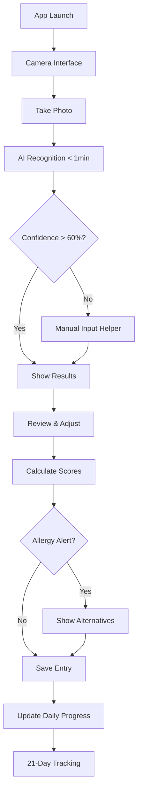

# Diet Daily - User Flows & Experience Design

## 🚀 Primary User Journey

### 📱 App Launch → Food Logging → Daily Scoring



---

## 📋 Detailed User Flow Specifications

### 🎯 Flow 1: First-Time User Setup

#### Step 1: Welcome & Introduction
**Screen**: Onboarding Welcome
- **Content**: "Track your food, manage allergies, feel better"
- **Action**: "Get Started" button
- **Time**: 10 seconds

#### Step 2: Health Profile Setup
**Screen**: Health Profile Creation
- **Content**:
  - "Select your health conditions" (multi-select checkboxes)
  - Options: Diabetes, Hypertension, Food Allergies, Weight Management, General Wellness
- **Required**: At least one selection
- **Time**: 30 seconds

#### Step 3: Allergy Detail Input
**Screen**: Allergy Specification (appears only if "Food Allergies" selected)
- **Content**:
  - "Tell us about your food allergies"
  - Text input: "List foods you need to avoid"
  - AI suggestion: "We'll find related foods automatically"
- **Logic**: AI processes input to identify related allergens
- **Time**: 1-2 minutes

#### Step 4: Google Integration
**Screen**: Data Storage Setup
- **Content**:
  - "Your data stays private in YOUR Google Drive"
  - Benefits: "Own your data, share with doctors, never lose it"
- **Action**: "Connect Google Account" → Google Sign-In flow
- **Backup**: "Skip for now" (local storage only)
- **Time**: 30 seconds + Google auth

#### Step 5: Permission Requests
**Screen**: Camera & Storage Permissions
- **Content**: Permission explanations with visual examples
- **Actions**:
  - Camera: "Allow" (required for core functionality)
  - Photos: "Allow" (for saving/reviewing)
  - Notifications: "Allow" (for daily reminders)
- **Time**: 20 seconds

**Total Onboarding Time**: 3-4 minutes

---

### 📸 Flow 2: Daily Food Logging (Core Flow)

#### Step 1: Camera Launch
**Screen**: Camera Interface
- **Design**: Full-screen camera with minimal UI
- **Features**:
  - Auto-focus on food items
  - Flash toggle for indoor lighting
  - "Manual Entry" button (small, bottom corner)
- **Offline**: Full functionality maintained
- **Time**: Instant launch

#### Step 2: Photo Capture
**Action**: Tap capture button
- **Feedback**: Shutter sound + visual confirmation
- **Processing**: Immediate local save + optimization
- **Options**: Retake or Continue
- **Multiple dishes**: "Add another photo" option
- **Time**: 2-3 seconds per photo

#### Step 3: AI Recognition Processing
**Screen**: Processing indicator
- **Visual**: Spinning wheel with food-related icons
- **Text**: "Analyzing your food..." with progress hints
- **Timeout**: 60 seconds maximum
- **Background**: Processing continues if user navigates away
- **Time**: 10-45 seconds average

#### Step 4: Results Display
**Screen**: Recognition Results
- **Layout**:
  - Photo thumbnail (top)
  - Recognized foods list (center)
  - Confidence indicators (color-coded)
  - "Edit" button for each item
- **Confidence Colors**:
  - Green (>70%): High confidence
  - Yellow (40-70%): Medium confidence
  - Red (<40%): Low confidence, needs review
- **Time**: Review takes 10-20 seconds

#### Step 5: Manual Adjustment (When Needed)
**Screen**: Food Entry Editor
- **Triggers**:
  - User taps "Edit" on any item
  - Low confidence recognition (<40%)
  - No recognition results found
- **Interface**:
  - Search box with Taiwan/HK food suggestions
  - Common foods quick-select grid
  - Cooking method selector
  - Portion size estimator (S/M/L)
- **Time**: 30-60 seconds for adjustments

#### Step 6: Health Scoring
**Screen**: Meal Score Results
- **Display**:
  - Large score number (1-10) with color coding
  - Score explanation: "Great choice!" or "Consider alternatives"
  - Allergy warnings (if applicable)
  - Nutrition balance indicator
- **Allergy Alerts**:
  - 🚫 Red (1-2): "Avoid - Strong allergy risk"
  - ⚠️ Yellow (3-5): "Caution - Consider alternatives"
  - ✅ Green (6-8): "OK in moderation"
  - 🎉 Blue (9-10): "Excellent choice!"
- **Time**: 5-10 seconds review

#### Step 7: Alternative Suggestions (When Triggered)
**Screen**: Food Alternatives
- **Triggers**:
  - Score < 6 (allergy or nutrition concerns)
  - User requests alternatives
- **Content**:
  - "Try these instead:" heading
  - 3 alternative suggestions with photos
  - Local store availability indicators
  - Price comparison (normal/budget options)
  - "Save for later" option
- **Actions**:
  - "Find in stores" → location-based store finder
  - "Remind me next time" → add to suggestions list
- **Time**: 15-30 seconds browsing

#### Step 8: Entry Confirmation & Save
**Screen**: Save Confirmation
- **Summary**: Final meal summary with score
- **Optional**:
  - "How do you feel?" emotion selector
  - "Add notes" text field
  - Meal timing adjustment (if needed)
- **Action**: "Save Entry" → sync to Google Sheets
- **Feedback**: Success animation + daily progress update
- **Time**: 5-10 seconds

**Total Core Flow Time**: 2-4 minutes per meal

---

### 📊 Flow 3: Daily Progress Review

#### Step 1: Daily Dashboard Access
**Trigger**: User opens app (not camera-first)
**Screen**: Today's Overview
- **Content**:
  - Today's average score (large display)
  - Meals logged today (photo grid)
  - Daily goal progress (visual meter)
  - "Add meal" prominent button

#### Step 2: Meal History Review
**Screen**: Daily Meal List
- **Layout**: Chronological list with photos
- **Details**: Time, score, main foods identified
- **Actions**: Tap to expand details, edit, or delete
- **Navigation**: Swipe between days

#### Step 3: Weekly Trends
**Screen**: 7-Day Overview
- **Visualization**: Score trend line graph
- **Insights**: "Your best day was..." / "Watch out for..."
- **Patterns**: Common problematic foods identification

---

### 🏆 Flow 4: 21-Day Progress Tracking

#### Step 1: Progress Dashboard
**Screen**: 21-Day Challenge View
- **Progress**: Day counter (Day 5 of 21)
- **Visualization**: Calendar heat map with daily scores
- **Milestones**: Weekly achievement badges
- **Motivation**: "Streak counter" for consistent days

#### Step 2: Wellness Correlation
**Screen**: Daily Feeling Check-in
- **Trigger**: End of day notification
- **Interface**:
  - "How did you feel today?" (1-10 scale)
  - Emoji mood selector
  - Optional note: "What made the difference?"
- **Time**: 30 seconds daily

#### Step 3: Weekly Insights
**Screen**: Progress Analytics
- **Charts**: Food score vs feeling correlation
- **Insights**: "You feel best when you score 8+"
- **Recommendations**: Personalized suggestions for improvement

---

## 🚨 Alternative & Error Flows

### ❌ Flow A: Poor Network Connection

#### Offline Photo Capture
1. Camera works normally (no network needed)
2. Photos saved locally with timestamp
3. "Offline mode" indicator in status bar
4. Recognition queued for when online

#### Delayed Processing
1. "Will process when connected" message
2. Background sync when network returns
3. Push notification when results ready
4. No loss of functionality

### 🔄 Flow B: AI Recognition Failure

#### Low Confidence Results
1. Show results with warning indicators
2. Pre-select items for user review
3. Prominent "Edit" buttons on uncertain items
4. Smart suggestions based on photo context

#### Complete Recognition Failure
1. "Couldn't recognize food" message
2. Automatic switch to manual entry mode
3. Quick-select grid of common Taiwan/HK foods
4. Search with autocomplete suggestions

### ⚠️ Flow C: High Allergy Risk

#### Critical Allergy Alert
1. Red screen with warning message
2. "This contains [allergen] - AVOID" text
3. Immediate alternative suggestions
4. Option to "Override" with confirmation
5. Log decision for pattern tracking

#### Multiple Allergy Conflicts
1. Prioritized list of concerns
2. Color-coded severity indicators
3. Comprehensive alternative suggestions
4. "Safe meal builder" helper tool

---

## 🎨 User Interface Specifications

### Design System

#### Color Palette
- **Primary Green**: #4CAF50 (safe foods, good scores)
- **Warning Yellow**: #FF9800 (caution, medium scores)
- **Alert Red**: #F44336 (dangerous, low scores)
- **Accent Blue**: #2196F3 (information, excellent scores)
- **Neutral Gray**: #757575 (secondary text, borders)

#### Typography
- **Headers**: SF Pro Display, Bold, 24-28pt
- **Body**: SF Pro Text, Regular, 16pt
- **Captions**: SF Pro Text, Medium, 14pt
- **Scores**: SF Pro Display, Bold, 36pt

#### Component Library
- **Score Display**: Circular progress ring with large number
- **Food Item Cards**: Photo + name + confidence indicator
- **Alert Banners**: Full-width with icon and action button
- **Progress Bars**: Rounded, animated, color-coded

### Screen Layouts

#### Camera Interface
```
┌─────────────────────┐
│     [Settings]      │
├─────────────────────┤
│                     │
│    CAMERA FEED      │
│                     │
│                     │
├─────────────────────┤
│  [Flash]  ⭕  [Gallery]│
│       [Manual Entry] │
└─────────────────────┘
```

#### Results Screen
```
┌─────────────────────┐
│   📸 [Photo Thumb]   │
├─────────────────────┤
│ 🍜 Beef Noodle ✅   │
│ 🥬 Vegetables  ⚠️   │
│ 🍲 Soup Base   ❌   │
├─────────────────────┤
│     Score: 6/10     │
│   ⚠️ Contains MSG    │
├─────────────────────┤
│  [View Alternatives] │
│     [Save Entry]     │
└─────────────────────┘
```

#### Alternatives Screen
```
┌─────────────────────┐
│  Try these instead: │
├─────────────────────┤
│ 🍜 Chicken Noodle   │
│ 📍 Available nearby  │
│ 💰 $3-5             │
├─────────────────────┤
│ 🥗 Vegetable Soup    │
│ 📍 Most grocery stores│
│ 💰 $2-4             │
├─────────────────────┤
│   [Find Stores]     │
│  [Save Suggestions] │
└─────────────────────┘
```

---

## 📊 Analytics & Metrics Tracking

### User Behavior Metrics
- **Photo Capture**: Time from launch to capture
- **Recognition Accuracy**: User corrections per entry
- **Alternative Adoption**: Suggestions accepted vs ignored
- **Daily Consistency**: Meals logged vs target (3-6)
- **21-Day Completion**: Users completing full cycle

### Technical Performance
- **Recognition Speed**: Photo to results timing
- **Offline Reliability**: Success rate without network
- **Sync Performance**: Local to cloud data transfer
- **App Responsiveness**: Screen transition timing

### Health Impact Metrics
- **Score Improvements**: Trending patterns over 21 days
- **Feeling Correlation**: Wellbeing vs food score relationship
- **Allergy Avoidance**: Successful prevention incidents
- **Alternative Success**: Improved scores after suggestions

---

## 🔧 Technical Implementation Notes

### State Management
```swift
enum AppState {
    case onboarding
    case cameraReady
    case processing
    case reviewResults
    case manualEntry
    case scoringComplete
    case showingAlternatives
}

class AppStateManager: ObservableObject {
    @Published var currentState: AppState = .onboarding
    @Published var currentMeal: MealEntry?
    @Published var dailyProgress: DailyProgress?
}
```

### Navigation Flow
```swift
struct NavigationCoordinator {
    func handlePhotoCapture(_ image: UIImage) {
        // Transition to processing state
        // Start AI recognition
        // Navigate to results when complete
    }

    func handleLowConfidence(_ results: [FoodItem]) {
        // Show manual entry helper
        // Pre-populate with best guesses
        // Highlight uncertain items
    }

    func handleAllergyAlert(_ allergens: [AllergyType]) {
        // Show critical alert screen
        // Present alternatives immediately
        // Log user decision
    }
}
```

### Offline Handling
```swift
class OfflineManager {
    func queueForProcessing(_ photo: UIImage, meal: MealType) {
        // Save to local queue
        // Show "will process later" message
        // Attempt processing when network available
    }

    func syncPendingEntries() async {
        // Process all queued photos
        // Update scores retroactively
        // Notify user of completed processing
    }
}
```

---

*Document Version: 1.0*
*Last Updated: 2025-01-14*
*Status: Ready for UI Development*