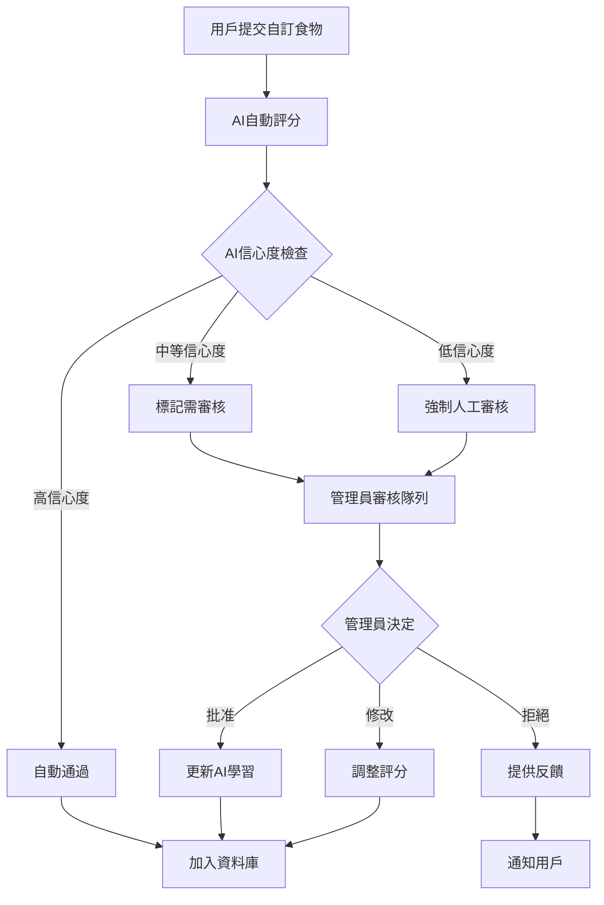

# 多疾病個人化食物資料庫系統設計

## 系統概述

設計一個支援多種疾病條件的個人化食物評分系統，包含IBD、IBS、癌症化療患者及食物過敏管理。採用0-5分評分制度，整合AI自動評分與管理員驗證流程。

## 核心需求

1. **多疾病支援**: IBD、IBS、癌症化療、食物過敏
2. **0-5分評分系統**: 從現有0-4分擴展
3. **AI驅動評分**: 自動評分 + 管理員驗證
4. **台灣食物為主**: 在地化食材與烹飪方式
5. **可擴展架構**: 未來支援更多疾病與食材

---

## 資料庫架構設計

### 1. 核心食物表格 (Enhanced Food Table)

```sql
-- 擴展現有食物表格支援多疾病評分
CREATE TABLE diet_daily_foods (
    id UUID PRIMARY KEY DEFAULT uuid_generate_v4(),
    name TEXT NOT NULL,
    name_en TEXT,
    brand TEXT,
    category TEXT NOT NULL,

    -- 基本營養資訊 (每100g)
    calories DECIMAL(8,2),
    protein DECIMAL(8,2),
    carbohydrates DECIMAL(8,2),
    fat DECIMAL(8,2),
    fiber DECIMAL(8,2),
    sugar DECIMAL(8,2),
    sodium DECIMAL(8,2),

    -- 詳細營養成分
    nutrition_data JSONB DEFAULT '{}'::jsonb,

    -- 多疾病評分系統 (0-5分)
    condition_scores JSONB DEFAULT '{
        "ibd": {
            "acute_phase": 0,
            "remission_phase": 0,
            "general_safety": 0
        },
        "ibs": {
            "general_safety": 0,
            "fodmap_level": "unknown",
            "trigger_risk": "unknown"
        },
        "cancer_chemo": {
            "general_safety": 0,
            "immune_support": 0,
            "nausea_friendly": 0,
            "nutrition_density": 0
        },
        "allergies": {
            "cross_contamination_risk": 0,
            "allergen_free_confidence": 0
        }
    }'::jsonb,

    -- 食物屬性分析
    food_properties JSONB DEFAULT '{
        "fiber_type": "unknown",
        "cooking_methods": [],
        "texture": "unknown",
        "acidity": "neutral",
        "spice_level": "none",
        "fat_type": "unknown",
        "preservation_method": "fresh",
        "fodmap_content": {},
        "allergen_info": {},
        "immune_properties": []
    }'::jsonb,

    -- 通用觸發因子分析
    trigger_analysis JSONB DEFAULT '{
        "high_fiber": false,
        "high_fat": false,
        "high_sugar": false,
        "spicy": false,
        "acidic": false,
        "raw": false,
        "fried": false,
        "processed": false,
        "high_fodmap": false,
        "common_allergens": [],
        "artificial_additives": false,
        "histamine_rich": false,
        "tyramine_rich": false
    }'::jsonb,

    -- 其他屬性
    allergens TEXT[] DEFAULT '{}',
    tags TEXT[] DEFAULT '{}',
    taiwan_origin BOOLEAN DEFAULT false,

    -- AI與驗證相關
    ai_analysis JSONB DEFAULT '{}'::jsonb,
    ai_confidence_scores JSONB DEFAULT '{}'::jsonb,
    verification_status TEXT DEFAULT 'pending' CHECK (verification_status IN ('pending', 'ai_approved', 'admin_approved', 'rejected')),
    verification_notes TEXT,
    verified_by UUID REFERENCES auth.users(id),
    verified_at TIMESTAMP WITH TIME ZONE,

    -- 版本控制
    version INTEGER DEFAULT 1,
    created_by UUID REFERENCES auth.users(id),
    is_custom BOOLEAN DEFAULT false,
    created_at TIMESTAMP WITH TIME ZONE DEFAULT NOW(),
    updated_at TIMESTAMP WITH TIME ZONE DEFAULT NOW()
);
```

### 2. 疾病配置表格

```sql
-- 疾病評分配置
CREATE TABLE medical_condition_configs (
    id UUID PRIMARY KEY DEFAULT uuid_generate_v4(),
    condition_code TEXT UNIQUE NOT NULL, -- 'ibd', 'ibs', 'cancer_chemo', 'allergies'
    condition_name TEXT NOT NULL,
    condition_name_zh TEXT NOT NULL,

    -- 評分準則配置
    scoring_criteria JSONB NOT NULL DEFAULT '{
        "score_ranges": {
            "0": "嚴重不適合",
            "1": "高風險",
            "2": "中等風險",
            "3": "基本安全",
            "4": "推薦",
            "5": "最佳選擇"
        },
        "phase_specific": false,
        "trigger_factors": [],
        "nutritional_priorities": []
    }'::jsonb,

    -- AI評分權重
    ai_scoring_weights JSONB NOT NULL DEFAULT '{}'::jsonb,

    is_active BOOLEAN DEFAULT true,
    created_at TIMESTAMP WITH TIME ZONE DEFAULT NOW(),
    updated_at TIMESTAMP WITH TIME ZONE DEFAULT NOW()
);
```

### 3. 患者檔案表格

```sql
-- 多疾病患者檔案
CREATE TABLE patient_profiles (
    id UUID PRIMARY KEY DEFAULT uuid_generate_v4(),
    user_id UUID REFERENCES auth.users(id) NOT NULL,

    -- 疾病資訊
    medical_conditions JSONB NOT NULL DEFAULT '[]'::jsonb, -- ['ibd', 'ibs']

    -- 疾病特定資料
    condition_details JSONB NOT NULL DEFAULT '{
        "ibd": {
            "type": null,
            "current_phase": null,
            "severity": null
        },
        "ibs": {
            "subtype": null,
            "severity": null
        },
        "cancer_chemo": {
            "cancer_type": null,
            "treatment_phase": null,
            "side_effects": []
        },
        "allergies": {
            "confirmed_allergens": [],
            "severity_levels": {}
        }
    }'::jsonb,

    -- 個人化設定
    personal_triggers TEXT[] DEFAULT '{}',
    safe_foods TEXT[] DEFAULT '{}',
    avoided_foods TEXT[] DEFAULT '{}',
    dietary_restrictions TEXT[] DEFAULT '{}',

    -- 症狀敏感度 (1-10)
    symptom_sensitivity JSONB DEFAULT '{
        "digestive": 5,
        "immune": 5,
        "energy": 5,
        "nausea": 5,
        "pain": 5
    }'::jsonb,

    -- 偏好設定
    preferences JSONB DEFAULT '{
        "fiber_tolerance": "moderate",
        "spice_tolerance": "moderate",
        "texture_preferences": [],
        "cultural_preferences": ["taiwanese"]
    }'::jsonb,

    updated_at TIMESTAMP WITH TIME ZONE DEFAULT NOW()
);
```

---

## 評分系統設計

### 0-5分評分標準

#### IBD (炎症性腸病)
```yaml
急性期評分:
  0: 嚴重觸發因子 (高纖維、辛辣、生食)
  1: 高風險 (中等纖維、油炸、加工食品)
  2: 中等風險 (適度烹調、低纖維)
  3: 基本安全 (易消化、溫和)
  4: 推薦 (抗炎、營養豐富)
  5: 最佳選擇 (療癒性食物、極易消化)

緩解期評分:
  0: 已知觸發因子
  1: 潛在風險食物
  2: 適量食用
  3: 日常安全
  4: 有益健康
  5: 腸道療癒
```

#### IBS (腸躁症)
```yaml
評分標準:
  0: 高FODMAP、已知觸發因子
  1: 中高FODMAP、個人觸發因子
  2: 中等FODMAP、需謹慎
  3: 低FODMAP、基本安全
  4: 極低FODMAP、推薦
  5: 腸道友善、症狀緩解
```

#### 癌症化療
```yaml
評分標準:
  0: 感染風險高、難消化
  1: 營養價值低、刺激性
  2: 適度營養、需注意
  3: 安全營養、易吸收
  4: 高營養密度、免疫支持
  5: 最佳療養食物、抗癌營養
```

#### 食物過敏
```yaml
評分標準:
  0: 含過敏原或高交叉污染風險
  1: 潛在交叉污染風險
  2: 低交叉污染風險
  3: 無過敏原、安全加工
  4: 過敏友善、認證安全
  5: 完全無風險、治療級安全
```

---

## AI評分框架設計

### 1. 多疾病評分服務

```typescript
interface MultiConditionScores {
  ibd?: {
    acute_phase: number
    remission_phase: number
    general_safety: number
  }
  ibs?: {
    general_safety: number
    fodmap_level: FODMAPLevel
    trigger_risk: RiskLevel
  }
  cancer_chemo?: {
    general_safety: number
    immune_support: number
    nausea_friendly: number
    nutrition_density: number
  }
  allergies?: {
    cross_contamination_risk: number
    allergen_free_confidence: number
  }
}

interface AIAnalysisResult {
  scores: MultiConditionScores
  confidence: Record<string, number>
  reasoning: Record<string, string[]>
  flags: string[]
  requires_human_review: boolean
}

class MultiConditionScoringService {
  static calculateScores(
    food: FoodData,
    conditions: string[]
  ): AIAnalysisResult {
    // 多疾病評分邏輯
  }

  static getConditionSpecificFactors(condition: string): AnalysisFactors {
    // 疾病特定分析因子
  }

  static determineReviewRequired(
    scores: MultiConditionScores,
    confidence: Record<string, number>
  ): boolean {
    // 判斷是否需要人工審核
  }
}
```

### 2. 疾病特定評分邏輯

```typescript
// IBD評分邏輯
class IBDScoringEngine {
  static calculateIBDScore(food: FoodData, phase: 'acute' | 'remission'): number {
    let score = 3 // 基準分數

    // 纖維含量影響
    if (food.fiber > 3 && phase === 'acute') score -= 2
    if (food.fiber < 1) score += 1

    // 加工程度影響
    if (food.properties.processing_level === 'highly_processed') score -= 1
    if (food.properties.cooking_methods.includes('steamed')) score += 1

    // 觸發因子影響
    if (food.trigger_analysis.spicy) score -= (phase === 'acute' ? 2 : 1)
    if (food.trigger_analysis.fried) score -= 1

    return Math.max(0, Math.min(5, score))
  }
}

// IBS評分邏輯
class IBSScoringEngine {
  static calculateIBSScore(food: FoodData): number {
    let score = 3

    // FODMAP含量影響
    const fodmapLevel = this.calculateFODMAPLevel(food)
    switch(fodmapLevel) {
      case 'high': score -= 2; break
      case 'moderate': score -= 1; break
      case 'low': score += 1; break
      case 'very_low': score += 2; break
    }

    // 個人觸發因子
    if (food.trigger_analysis.high_fat) score -= 1
    if (food.properties.fiber_type === 'soluble') score += 1

    return Math.max(0, Math.min(5, score))
  }
}
```

---

## 管理員驗證工作流程

### 1. 自訂食物提交流程



### 2. 管理員介面設計

```typescript
interface AdminReviewItem {
  id: string
  food_name: string
  submitter: string
  submission_date: string
  ai_scores: MultiConditionScores
  ai_confidence: Record<string, number>
  ai_reasoning: Record<string, string[]>
  requires_review_reasons: string[]
  priority: 'low' | 'medium' | 'high'
}

interface AdminReviewInterface {
  // 待審核列表
  pending_reviews: AdminReviewItem[]

  // 批量操作
  batchApprove(ids: string[]): Promise<void>
  batchReject(ids: string[], reason: string): Promise<void>

  // 個別審核
  reviewFood(id: string, decision: ReviewDecision): Promise<void>

  // AI效能追蹤
  getAIAccuracyStats(): AIPerformanceStats
}
```

---

## 可擴展架構設計

### 1. 外掛式疾病模組

```typescript
interface ConditionModule {
  conditionCode: string
  conditionName: string

  // 評分邏輯
  calculateScore(food: FoodData, patientProfile?: any): number

  // 觸發因子分析
  analyzeTriggers(food: FoodData): TriggerAnalysis

  // 個人化調整
  personalizeScore(baseScore: number, profile: any): number

  // 配置
  getDefaultConfig(): ConditionConfig
  validateConfig(config: any): boolean
}

class ConditionRegistry {
  private static modules = new Map<string, ConditionModule>()

  static register(module: ConditionModule): void {
    this.modules.set(module.conditionCode, module)
  }

  static getModule(conditionCode: string): ConditionModule | null {
    return this.modules.get(conditionCode) || null
  }

  static getSupportedConditions(): string[] {
    return Array.from(this.modules.keys())
  }
}

// 使用範例
ConditionRegistry.register(new IBDModule())
ConditionRegistry.register(new IBSModule())
ConditionRegistry.register(new CancerChemoModule())
ConditionRegistry.register(new AllergyModule())
```

### 2. API架構設計

```typescript
// RESTful API設計
interface FoodDatabaseAPI {
  // 多疾病搜尋
  'GET /api/foods/search': {
    params: {
      query: string
      conditions: string[]
      user_id?: string
      taiwan_only?: boolean
      min_score?: number
    }
    response: {
      foods: EnhancedFood[]
      personalized_scores?: PersonalizedScores[]
    }
  }

  // 疾病特定推薦
  'GET /api/foods/recommendations': {
    params: {
      condition: string
      phase?: string
      user_id: string
      limit?: number
    }
    response: RecommendedFood[]
  }

  // 自訂食物提交
  'POST /api/foods/custom': {
    body: CustomFoodSubmission
    response: {
      food_id: string
      ai_scores: MultiConditionScores
      verification_status: string
      estimated_review_time?: string
    }
  }

  // 管理員審核
  'GET /api/admin/pending-foods': {
    response: AdminReviewItem[]
  }

  'POST /api/admin/review-food/:id': {
    body: ReviewDecision
    response: { success: boolean }
  }
}
```

---

## 台灣食物資料庫擴展

### 1. 台灣特色食材分類

```yaml
主食類:
  - 白米飯、糙米飯、五穀飯
  - 麵條類: 陽春麵、米粉、冬粉
  - 粥品: 白粥、地瓜粥、小米粥

蛋白質類:
  - 豆腐製品: 傳統豆腐、嫩豆腐、豆乾
  - 海鮮: 虱目魚、鯖魚、蛤蠣
  - 肉類: 豬肉、雞肉、牛肉

蔬菜類:
  - 葉菜: 高麗菜、菠菜、小白菜
  - 根莖類: 地瓜、芋頭、蓮藕
  - 瓜果類: 冬瓜、絲瓜、苦瓜

水果類:
  - 溫帶水果: 蘋果、梨子、葡萄
  - 熱帶水果: 芭樂、木瓜、香蕉

調味料與香料:
  - 傳統調味: 醬油、米酒、香油
  - 香料: 薑、蒜、蔥、九層塔
```

### 2. 台灣烹飪方式評分

```yaml
烹飪方式風險評級:
  蒸: 0 # 最低風險
  煮: 0
  燉: 1
  炒: 2
  烤: 2
  炸: 4 # 最高風險

台灣特色烹調:
  清蒸: 最適合急性期患者
  滷煮: 適合緩解期患者
  快炒: 需注意油量與香料
  紅燒: 糖分較高需注意
```

---

## 實作階段規劃

### Phase 1: 核心架構 (2-3週)
1. 資料庫schema實作
2. 多疾病評分框架
3. 基本AI評分邏輯
4. API基礎架構

### Phase 2: 疾病模組 (3-4週)
1. IBD模組擴展(0-5分)
2. IBS評分模組
3. 癌症化療模組
4. 過敏管理模組

### Phase 3: 管理系統 (2-3週)
1. 管理員審核介面
2. 自訂食物工作流程
3. AI效能監控
4. 批量資料管理

### Phase 4: 使用者體驗 (2-3週)
1. 多疾病搜尋介面
2. 個人化推薦系統
3. 患者檔案管理
4. 行動端最佳化

### Phase 5: 台灣化與優化 (2週)
1. 台灣食材資料庫
2. 在地化介面
3. 效能優化
4. 使用者測試

---

## 品質保證與維護

### 1. 資料品質控制
- AI評分準確度追蹤 (目標: >85%)
- 管理員審核一致性檢查
- 使用者反饋整合機制
- 定期資料庫清理與更新

### 2. 系統監控
- API效能監控
- 資料庫查詢最佳化
- 使用者行為分析
- 錯誤追蹤與修復

### 3. 持續改進
- A/B測試評分演算法
- 使用者滿意度調查
- 疾病專家諮詢回饋
- 國際標準同步更新

---

## 技術棧總結

**後端**: Supabase + PostgreSQL + Edge Functions
**前端**: Next.js + TypeScript + Tailwind CSS
**AI服務**: 規則式AI + 機器學習模型
**部署**: Vercel + CDN
**監控**: 內建分析 + 自訂儀表板

這個設計提供了完整的多疾病個人化食物評分系統，具備高度可擴展性與台灣在地化特色，同時保持了與現有IBD系統的兼容性。