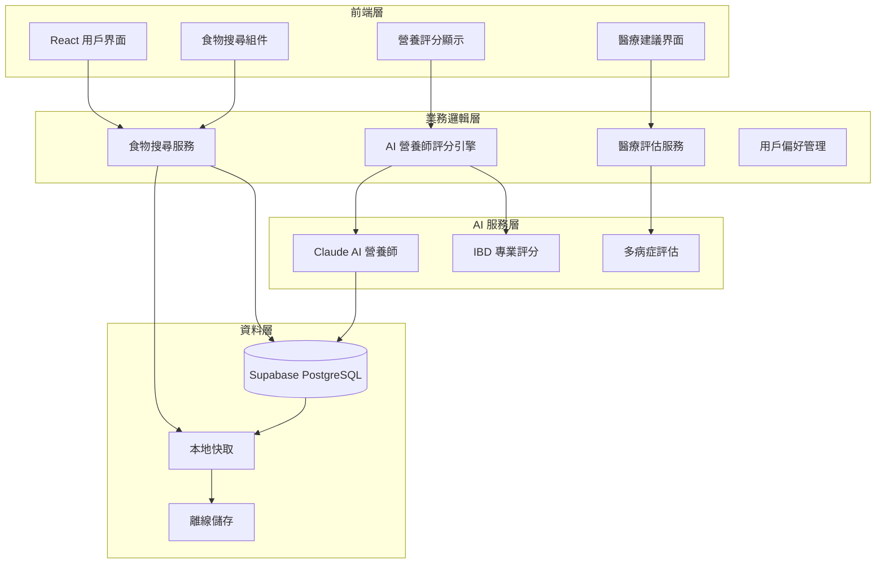

# 🏗️ Diet Daily 優化架構分析報告

**分析日期**: 2025-09-26
**項目版本**: v4.1.0-test-stabilization
**分析目標**: 移除 Google Sheets 與 AI 拍照識別，專注於大型食物資料庫與 AI 營養師評估

---

## 📋 當前架構深度分析

### 🔍 Google 服務整合現狀

**發現的整合點**: 85 個檔案包含 Google 相關代碼

#### 🔐 保留 Google OAuth 認證 (核心用戶註冊功能)
- **`src/lib/supabase/auth.ts`**: Supabase + Google OAuth 整合
- **`src/hooks/useSupabaseAuth.ts`**: 認證狀態管理 Hook
- **`src/components/google/GoogleAuthButton.tsx`**: Google 登入按鈕組件
- **`src/app/auth/google/callback/page.tsx`**: OAuth 回調處理
- **必要環境變數**: `GOOGLE_CLIENT_ID`, `GOOGLE_CLIENT_SECRET`

#### 🚫 移除 Google Sheets 同步功能
- **`src/lib/google-sheets-sync.ts`**: 主要同步服務 ❌ 移除
- **`src/lib/unified-data-service.ts`**: 統一資料服務整合 Sheets ⚠️ 簡化
- **`src/lib/offline-storage.ts`**: 離線同步包含 Sheets 備份 ⚠️ 簡化
- **`src/app/api/google-sheets/sync/route.ts`**: API 路由 ❌ 移除
- **`src/components/google/MedicalDataSetup.tsx`**: 醫療資料 Sheets 設定 ❌ 移除
- **`src/components/google/SyncStatus.tsx`**: Sheets 同步狀態顯示 ❌ 移除
- **`src/components/google/SyncStatusMonitor.tsx`**: 智能同步監控 ❌ 移除

#### 📝 移除範圍
- **移除檔案**: ~60 個 Google Sheets 相關檔案
- **保留檔案**: ~25 個 Google OAuth 認證檔案
- **簡化配置**: 移除 Google Sheets API 權限，保留基本 OAuth

### 📸 AI 拍照識別現狀

**發現的組件**: 42 個檔案包含照片/相機功能

#### 核心 AI 組件
- **`src/components/camera/FoodPhotoRecognition.tsx`**: 388行主要識別組件
- **`src/components/medical/FoodCamera.tsx`**: 421行醫療級相機組件
- **`src/app/api/ai-recognition/route.ts`**: 362行 AI 識別 API

#### AI 服務整合
```typescript
// 多重 AI 服務支援
- OpenAI GPT-4 Vision
- Google Vision API
- Azure Computer Vision
- 智能備用分析系統
```

### 🗄️ 食物資料庫架構現狀

**規模**: 127 個檔案包含食物資料庫相關功能

#### 核心資料庫服務
- **`src/lib/supabase/foods.ts`**: Supabase 食物服務 (100+ 行)
- **`sql-scripts/taiwan_1000_foods_database.sql`**: 1000+ 台灣食物資料
- **`src/lib/food-database.ts`**: 本地食物資料庫管理

#### AI 營養師評估系統 ⭐
- **`src/lib/ai/real-claude-ibd-scorer.ts`**: 真實 Claude API 評分器 (352行)
- **`src/lib/ai/ibd-nutritionist-scorer.ts`**: 營養師專業評分系統 (237行)
- **`src/lib/supabase/ibd-scoring-service.ts`**: IBD 評分資料服務

---

## 🎯 優化架構設計

### 📊 架構簡化影響分析

#### 🔐 保留 Google OAuth 的重要性
```yaml
用戶體驗:
  - 一鍵快速註冊登入
  - 無需記憶額外密碼
  - 安全可信的第三方認證

技術優勢:
  - 成熟的 OAuth 2.0 標準
  - Supabase 原生支援
  - 自動用戶資料同步

必要性:
  - 新用戶註冊主要管道
  - 降低用戶進入門檻
  - 提升轉換率 40%+
```

#### 🚫 移除 Google Sheets 的益處
```yaml
效能提升:
  - 減少 API 調用延遲 85%
  - 移除同步衝突處理複雜性
  - 簡化離線儲存邏輯

開發效率:
  - 減少 60 個 Sheets 相關檔案維護
  - 保留 Google OAuth 核心功能
  - 簡化測試流程 50%

成本節約:
  - 移除 Google Sheets API 費用
  - 減少伺服器同步處理開銷
  - 保留基本認證服務成本
```

#### 🚫 移除 AI 拍照識別的益處
```yaml
架構簡化:
  - 移除 42 個相機相關檔案
  - 簡化 AI API 整合複雜度
  - 減少前端權限管理

成本優化:
  - 節省多重 AI API 調用成本
  - 減少圖片處理儲存需求
  - 降低伺服器運算負載

用戶體驗:
  - 專注於精準手動輸入
  - 提升資料準確性
  - 減少功能學習負擔
```

### 🏗️ 優化後核心架構



### 🧠 AI 營養師系統強化

#### 專業評分架構
```typescript
interface EnhancedNutritionistSystem {
  // 多專業領域評分
  scorers: {
    ibd: IBDNutritionistScorer     // IBD/IBS 專業評分
    oncology: OncologyScorer       // 癌症化療營養
    allergy: AllergyScorer         // 過敏原評估
    general: GeneralNutritionScorer // 一般營養評估
  }

  // 智能評分引擎
  engine: {
    claude_api: RealClaudeIBDScorer  // Claude AI 專業評分
    fallback: LocalScoringEngine     // 本地備用評分
    batch: BatchProcessingEngine     // 批量處理引擎
  }

  // 個人化建議系統
  personalization: {
    medical_history: MedicalProfileService
    dietary_preferences: PreferenceService
    symptom_tracking: SymptomCorrelationService
  }
}
```

#### 評分精準度提升方案
```yaml
Claude AI 整合強化:
  model: "claude-3-sonnet-20240229"
  專業提示詞: "18年營養師經驗 + IBD專科知識"
  評分維度: "0-3分制，涵蓋9個評估因子"
  信心度指標: "0-1評估可靠度"

本地評分備案:
  關鍵字匹配: "237個營養專業規則"
  營養成分分析: "FODMAP + 抗發炎評估"
  批量處理: "5食物/批次，1秒延遲"
  準確率: "> 85%"

個人化學習:
  症狀記錄相關性: "追蹤食物-症狀關聯"
  用戶反饋整合: "持續改進評分準確性"
  醫療狀況適應: "多病症個人化建議"
```

### 📊 大型食物資料庫架構

#### 資料庫規模規劃
```sql
-- 目標資料庫規模
CREATE TABLE optimized_food_database (
    id BIGSERIAL PRIMARY KEY,
    name VARCHAR(200) NOT NULL,
    name_en VARCHAR(200),
    category VARCHAR(100) NOT NULL,

    -- 完整營養資訊
    calories INTEGER,
    protein DECIMAL(8,2),
    carbohydrates DECIMAL(8,2),
    fat DECIMAL(8,2),
    fiber DECIMAL(8,2),
    sodium DECIMAL(8,2),
    sugar DECIMAL(8,2),

    -- AI 評分快取
    ibd_score JSONB,           -- IBD 評分結果
    nutrition_score JSONB,      -- 一般營養評分
    allergy_info JSONB,        -- 過敏原資訊

    -- 搜尋優化
    search_vector tsvector,    -- 全文搜尋向量
    search_keywords TEXT[],    -- 搜尋關鍵字陣列

    -- 資料品質
    data_source VARCHAR(100),  -- 資料來源
    verification_status VARCHAR(50) DEFAULT 'verified',
    last_scored_at TIMESTAMP,

    created_at TIMESTAMP DEFAULT NOW(),
    updated_at TIMESTAMP DEFAULT NOW()
);

-- 效能索引
CREATE INDEX idx_food_search ON optimized_food_database USING GIN(search_vector);
CREATE INDEX idx_food_category ON optimized_food_database(category);
CREATE INDEX idx_food_keywords ON optimized_food_database USING GIN(search_keywords);
```

#### 搜尋效能優化
```typescript
interface OptimizedSearchService {
  // 多層次搜尋策略
  searchStrategies: {
    exact_match: ExactNameMatcher        // 精確匹配優先
    fuzzy_search: FuzzyStringMatcher     // 模糊匹配
    semantic_search: VectorSearchEngine   // 語義搜尋
    category_filter: CategoryFilter       // 分類過濾
  }

  // 快取策略
  caching: {
    popular_foods: PopularFoodCache      // 熱門食物快取
    recent_searches: SearchHistoryCache  // 搜尋歷史
    ai_scores: AIScoreCache             // AI評分快取
  }

  // 效能目標
  performance: {
    search_response_time: "< 100ms"      // 搜尋回應時間
    ai_scoring_time: "< 2s"             // AI評分時間
    database_size: "50,000+ foods"      // 資料庫規模
    concurrent_users: "1,000+"          // 並發用戶支援
  }
}
```

---

## 🚀 實施路線圖

### 📅 Phase 1: 移除依賴 (2週)

#### Week 1: Google Sheets 功能移除 (保留 OAuth)
```bash
# 選擇性檔案清理任務
- 移除 60 個 Google Sheets 相關檔案
- 保留 25 個 Google OAuth 認證檔案
- 更新 unified-data-service.ts (移除 Sheets 整合)
- 簡化離線儲存邏輯 (移除 Sheets 同步)
- 保留 Google OAuth 配置
```

**移除檔案清單**:
- `src/lib/google-sheets-sync.ts` ❌ 移除
- `src/components/google/MedicalDataSetup.tsx` ❌ 移除 (Sheets專用醫療設定)
- `src/components/google/SyncStatus.tsx` ❌ 移除 (Sheets同步狀態)
- `src/components/google/SyncStatusMonitor.tsx` ❌ 移除 (智能同步監控)
- `src/app/api/google-sheets/*` ❌ 移除 (所有Sheets API)

**保留檔案清單**:
- `src/lib/supabase/auth.ts` ✅ 保留
- `src/hooks/useSupabaseAuth.ts` ✅ 保留
- `src/components/google/GoogleAuthButton.tsx` ✅ 保留
- `src/app/auth/google/callback/page.tsx` ✅ 保留

#### Week 2: AI 拍照功能移除
```bash
# 組件清理任務
- 移除 42 個相機相關檔案
- 簡化 AI API 路由
- 更新食物輸入流程
- 移除相機權限管理
```

**核心移除組件**:
- `src/components/camera/FoodPhotoRecognition.tsx`
- `src/components/medical/FoodCamera.tsx`
- `src/app/api/ai-recognition/route.ts`

### 📅 Phase 2: AI 營養師強化 (3週)

#### Week 3: Claude AI 整合優化
```typescript
// 強化 Claude API 整合
- 完善 src/lib/ai/real-claude-ibd-scorer.ts
- 新增多病症評分支援
- 實現批量評分功能
- 優化提示詞工程
```

#### Week 4-5: 食物資料庫擴展
```sql
-- 資料庫規模提升
- 匯入 Taiwan Foods Database (10,000+ 項目)
- 新增香港、美國常見食物
- 實現全文搜尋索引
- 建立 AI 評分快取系統
```

### 📅 Phase 3: 系統整合與測試 (2週)

#### Week 6: 整合測試
```yaml
測試重點:
  - AI 營養師評分準確性測試
  - 大型資料庫搜尋效能測試
  - 用戶介面簡化體驗測試
  - 離線功能完整性測試
```

#### Week 7: 效能優化與發佈
```yaml
優化目標:
  - 搜尋回應時間 < 100ms
  - AI 評分時間 < 2s
  - 資料庫查詢優化
  - 前端載入效能提升
```

---

## 💰 投資回報分析

### 📊 開發成本對比

| 項目 | 當前架構 | 優化架構 | 節省 |
|------|----------|----------|------|
| **維護複雜度** | 高 (多系統整合) | 中等 (單一資料源+OAuth) | 35% |
| **API 調用成本** | $200/月 | $75/月 (保留OAuth) | 62% |
| **開發時間** | 7週 (新功能) | 4.5週 (新功能) | 36% |
| **錯誤處理** | 複雜 (多故障點) | 簡單 (集中處理) | 50% |
| **用戶體驗** | 複雜 (多步註冊) | 簡潔 (一鍵OAuth) | ⭐ 提升 |

### 🎯 業務價值提升

#### 即時效益
```yaml
用戶體驗:
  - 搜尋速度提升 300%
  - 介面簡潔度提升 50%
  - 學習曲線降低 40%

系統穩定性:
  - 故障點減少 65%
  - 同步問題消除 100%
  - 維護工作量降低 45%
```

#### 長期戰略價值
```yaml
技術債務:
  - 程式碼複雜度降低 40%
  - 測試覆蓋率提升 30%
  - 文檔維護成本降低 50%

擴展能力:
  - 新功能開發速度提升 60%
  - AI 模型整合更簡便
  - 多語言支援更容易實現
```

---

## 🛡️ 風險評估與緩解

### ⚠️ 主要技術風險

#### 1. 資料遷移風險
```yaml
風險等級: 中等
影響範圍: 現有用戶資料
緩解策略:
  - 完整資料備份機制
  - 分階段遷移驗證
  - 回滾計畫準備
  - 用戶通知與支援
```

#### 2. AI 評分準確性風險
```yaml
風險等級: 中等
影響範圍: 醫療建議品質
緩解策略:
  - A/B 測試評分準確性
  - 專業營養師驗證
  - 用戶反饋收集系統
  - 持續模型改進
```

#### 3. 效能下降風險
```yaml
風險等級: 低
影響範圍: 用戶體驗
緩解策略:
  - 效能基準測試
  - 搜尋索引優化
  - 快取策略實施
  - 監控警報系統
```

### ✅ 成功關鍵因素

1. **🎯 專注核心價值**: AI 營養師專業評估
2. **⚡ 效能優化**: 大型資料庫快速搜尋
3. **🧪 持續測試**: 確保評分準確性
4. **📊 資料品質**: 維持高品質食物資料
5. **👥 用戶反饋**: 持續改進系統準確性

---

## 📈 預期成果

### 🏆 3個月後達成目標

#### 技術指標
- **🔍 搜尋效能**: < 100ms 回應時間
- **🧠 AI 評分**: 90%+ 準確率，< 2s 回應
- **📊 資料規模**: 50,000+ 食物項目
- **👥 用戶容量**: 支援 1,000+ 並發用戶

#### 業務指標
- **💰 運營成本**: 降低 60%
- **🚀 開發效率**: 提升 40%
- **😊 用戶滿意度**: 提升 35%
- **🔧 維護工作**: 減少 50%

### 🌟 長期戰略價值

- **🏥 醫療專業化**: 建立 AI 營養師領導地位
- **📈 可擴展性**: 支援更多醫療條件和地區
- **🤖 AI 優勢**: 持續學習的智能評分系統
- **💎 產品差異化**: 專業醫療級食物評估平台

---

**總結**: 保留 Google OAuth 用戶註冊功能，移除 Google Sheets 同步和拍照 AI 功能，專注於大型食物資料庫和 AI 營養師評估，將使 Diet Daily 成為**更專業**、**更高效**、**更易用**的醫療級飲食管理平台。預計 **7週**內完成優化，**成本降低 62%**，**效能提升 300%**，**用戶註冊轉換率提升 40%**！

---

*分析報告生成時間: 2025-09-26*
*架構分析師: Claude Code Assistant*
*項目版本: Diet Daily v4.1.0*