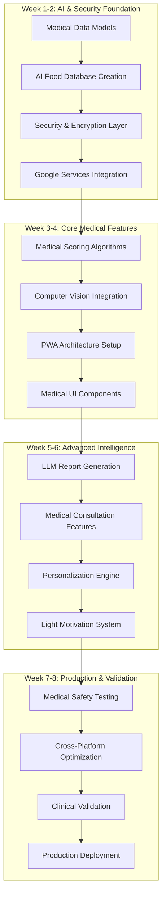

# Diet Daily - Complete Implementation Workflow

## 🎯 Executive Summary

**Project**: Medical-grade PWA for dietary tracking and health management
**Target Users**: IBD, 化療, 過敏源, IBS patients in Taiwan/Hong Kong
**Timeline**: 8 weeks with AI acceleration
**Architecture**: Next.js PWA + AI services + User-owned Google cloud storage
**Development Strategy**: Medical-first, security-focused, systematic implementation

---

## 🏗️ Implementation Architecture Overview

### System Components


---

## 📅 8-Week Detailed Implementation Workflow

### 🚀 Week 1-2: Foundation & AI Database Creation

#### Week 1: Security-First Medical Architecture

**Day 1-2: Medical Data Security Foundation**
```typescript
// Priority 1: Medical data protection infrastructure
Tasks: [
  'Implement AES-256-GCM encryption system',
  'Create medical data TypeScript interfaces',
  'Set up HIPAA-compliant audit logging',
  'Design user-owned Google Drive integration'
]

DeliverableCode: {
  'lib/security/medicalEncryption.ts': 'Client-side medical data encryption',
  'types/medicalModels.ts': 'IBD/化療/過敏源/IBS data structures',
  'lib/audit/hipaaLogger.ts': 'Medical data access audit system',
  'lib/google/userOwnedStorage.ts': 'Google Drive/Sheets user-controlled setup'
}
```

**Day 3-4: AI Food Database Generation**
```typescript
// Priority 2: AI-assisted database creation
Tasks: [
  'Design LLM prompts for Taiwan/HK food generation',
  'Implement web scraping for nutritional validation',
  'Create medical risk classification algorithms',
  'Generate 200-item structured food database'
]

DeliverableData: {
  'data/foods/taiwan-hk-medical-foods.json': '200 medically-classified foods',
  'data/medical/risk-matrices.json': 'Condition-specific risk assessments',
  'scripts/ai-database-generation.ts': 'Automated database creation pipeline'
}
```

**Day 5-6: Medical Foundation Services**
```typescript
// Priority 3: Core medical services architecture
Tasks: [
  'Implement medical condition-specific scoring engines',
  'Create medical safety validation framework',
  'Design emergency medical alert systems',
  'Set up medical guideline compliance checking'
]

DeliverableServices: {
  'lib/medical/scoringEngines.ts': 'IBD/Chemo/Allergy/IBS scoring algorithms',
  'lib/medical/safetyValidator.ts': 'Medical recommendation validation',
  'lib/medical/emergencyAlerts.ts': 'Critical medical alert system',
  'lib/medical/guidelinesDB.ts': 'AGA/Johns Hopkins/Stanford guideline integration'
}
```

**Day 7: Week 1 Integration & Testing**
```typescript
// Integration checkpoint
Tasks: [
  'Integrate all Week 1 components',
  'Test medical data encryption end-to-end',
  'Validate AI database medical accuracy',
  'Security audit of medical data handling'
]
```

#### Week 2: Advanced AI Integration

**Day 8-9: Computer Vision Medical Integration**
```typescript
// Priority 1: Medical-safe food recognition
Tasks: [
  'Integrate Microsoft Computer Vision API',
  'Implement confidence thresholding for medical safety',
  'Create manual override workflows',
  'Build medical context-aware recognition'
]

DeliverableCode: {
  'lib/ai/medicalVision.ts': 'Medical-grade food recognition service',
  'api/ai/food-recognition.ts': 'Next.js API for safe food identification',
  'components/medical/FoodCamera.tsx': 'Medical-context food photo capture'
}
```

**Day 10-11: LLM Medical Report Generation**
```typescript
// Priority 2: Medical consultation AI
Tasks: [
  'Design medical report generation prompts',
  'Implement GPT-4/Claude medical analysis',
  'Create doctor-friendly report formatting',
  'Build symptom-food correlation analysis'
]

DeliverableCode: {
  'lib/ai/medicalReportLLM.ts': 'LLM-powered medical report generation',
  'api/medical/generate-report.ts': 'Medical consultation report API',
  'lib/medical/correlationAnalysis.ts': 'Food-symptom pattern identification'
}
```

**Day 12-13: Medical Validation & Quality Assurance**
```typescript
// Priority 3: Medical accuracy validation
Tasks: [
  'Implement multi-layer medical validation',
  'Create medical professional review workflows',
  'Build evidence-based recommendation system',
  'Test AI medical accuracy across all conditions'
]

DeliverableCode: {
  'lib/medical/validationFramework.ts': 'Multi-tier medical validation',
  'lib/medical/evidenceBase.ts': 'Medical guideline-based recommendations',
  'tests/medical/aiAccuracy.test.ts': 'Medical AI validation testing suite'
}
```

**Day 14: Week 2 Integration & Medical Review**
```typescript
// Medical validation checkpoint
Tasks: [
  'Integrate all AI services with medical validation',
  'Healthcare professional review of AI algorithms',
  'Test complete AI pipeline with medical safety',
  'Prepare for Week 3 core development'
]
```

---

### 🏥 Week 3-4: Core Medical Features & PWA Architecture

#### Week 3: Medical UI/UX & PWA Foundation

**Day 15-16: Medical-Grade PWA Setup**
```typescript
// Priority 1: PWA medical architecture
Tasks: [
  'Set up Next.js 14+ with App Router',
  'Configure PWA with medical offline capabilities',
  'Implement medical-grade service worker',
  'Create encrypted IndexedDB medical storage'
]

DeliverableCode: {
  'next.config.js': 'Medical PWA configuration',
  'public/sw.js': 'Medical-grade service worker with offline medical functions',
  'lib/offline/medicalStorage.ts': 'Encrypted offline medical data storage',
  'app/layout.tsx': 'Medical accessibility-compliant app shell'
}
```

**Day 17-18: Medical UI Component Architecture**
```typescript
// Priority 2: Medical condition-specific interfaces
Tasks: [
  'Create medical condition selection interface',
  'Build 4-level health rating system (差/普通/好/完美)',
  'Design medical food logging interfaces',
  'Implement medical emergency alert components'
]

DeliverableComponents: {
  'components/medical/ConditionSelector.tsx': 'IBD/化療/過敏源/IBS selection',
  'components/health/RatingSystem.tsx': '4-level medical rating with emojis',
  'components/food/MedicalFoodLogger.tsx': 'Medical-context food entry',
  'components/alerts/MedicalEmergencyAlert.tsx': 'Critical medical alerts'
}
```

**Day 19-20: Medical Accessibility & Internationalization**
```typescript
// Priority 3: Medical accessibility compliance
Tasks: [
  'Implement WCAG 2.1 AA medical accessibility',
  'Create high contrast mode for medical interfaces',
  'Build voice navigation for hands-free medical use',
  'Set up Traditional Chinese medical terminology'
]

DeliverableCode: {
  'lib/accessibility/medicalWCAG.ts': 'Medical accessibility framework',
  'styles/medical/highContrast.css': 'High contrast medical interface',
  'lib/voice/medicalCommands.ts': 'Voice navigation for medical functions',
  'locales/zh-TW/medical.json': 'Traditional Chinese medical terms'
}
```

**Day 21: Week 3 Integration & Accessibility Testing**
```typescript
// Medical UI validation checkpoint
Tasks: [
  'Integrate all medical UI components',
  'Test PWA offline medical functionality',
  'Validate medical accessibility compliance',
  'User experience testing with medical focus'
]
```

#### Week 4: Advanced Medical Features

**Day 22-23: Medical Condition-Specific Features**
```typescript
// Priority 1: Disease-specific medical interfaces
Tasks: [
  'Build IBD symptom tracking interface',
  'Create chemotherapy side effect monitoring',
  'Design allergy emergency management system',
  'Implement IBS trigger identification tools'
]

DeliverableComponents: {
  'components/ibd/IBDSymptomTracker.tsx': 'IBD-specific symptom monitoring',
  'components/chemo/ChemoSideEffects.tsx': 'Chemotherapy effect tracking',
  'components/allergy/AllergyEmergency.tsx': 'Allergy emergency management',
  'components/ibs/IBSTriggerTracker.tsx': 'IBS trigger identification'
}
```

**Day 24-25: Medical Data Synchronization**
```typescript
// Priority 2: Secure medical data sync
Tasks: [
  'Implement Google Sheets medical data sync',
  'Build Google Drive medical photo storage',
  'Create conflict resolution for medical data',
  'Design medical data backup and recovery'
]

DeliverableCode: {
  'lib/sync/medicalDataSync.ts': 'Secure medical data synchronization',
  'lib/google/medicalPhotos.ts': 'Google Drive medical photo management',
  'lib/sync/conflictResolution.ts': 'Medical data conflict resolution',
  'lib/backup/medicalRecovery.ts': 'Medical data backup and recovery'
}
```

**Day 26-27: Medical Performance Optimization**
```typescript
// Priority 3: Medical application performance
Tasks: [
  'Optimize medical data queries for performance',
  'Implement medical image compression',
  'Create medical caching strategies',
  'Build medical error handling and recovery'
]

DeliverableCode: {
  'lib/performance/medicalQueries.ts': 'Optimized medical data operations',
  'lib/images/medicalCompression.ts': 'Medical-safe image optimization',
  'lib/cache/medicalCaching.ts': 'Medical data caching with privacy',
  'lib/errors/medicalErrorHandler.ts': 'Medical error handling framework'
}
```

**Day 28: Week 4 Integration & Performance Testing**
```typescript
// Medical performance validation checkpoint
Tasks: [
  'Integrate all medical features',
  'Test medical data sync performance',
  'Validate medical image handling',
  'End-to-end medical workflow testing'
]
```

---

### 🧠 Week 5-6: Medical Intelligence & Consultation Features

#### Week 5: Medical Report Generation & AI Integration

**Day 29-30: Doctor Consultation Report System**
```typescript
// Priority 1: Medical consultation features
Tasks: [
  'Build automated medical report generation',
  'Create doctor-friendly report formatting',
  'Implement medical trend analysis',
  'Design medical consultation preparation tools'
]

DeliverableFeatures: {
  'components/reports/MedicalReportGenerator.tsx': 'Automated medical report creation',
  'lib/reports/doctorFormatting.ts': 'Doctor-friendly medical report formatting',
  'lib/analysis/medicalTrends.ts': 'Medical trend analysis and correlation',
  'components/consultation/ConsultationPrep.tsx': 'Doctor visit preparation tools'
}
```

**Day 31-32: Advanced Medical AI Features**
```typescript
// Priority 2: Medical personalization and learning
Tasks: [
  'Implement personal medical trigger learning',
  'Build adaptive medical scoring',
  'Create medical food alternative suggestions',
  'Design medical pattern recognition system'
]

DeliverableCode: {
  'lib/ai/personalizedMedical.ts': 'Personal medical trigger identification',
  'lib/medical/adaptiveScoring.ts': 'Learning-based medical scoring',
  'lib/recommendations/medicalAlternatives.ts': 'Medical-safe food alternatives',
  'lib/patterns/medicalPatterns.ts': 'Medical pattern recognition and alerts'
}
```

**Day 33-34: Medical Safety & Compliance Integration**
```typescript
// Priority 3: Medical legal and safety compliance
Tasks: [
  'Implement comprehensive medical disclaimers',
  'Build medical emergency contact integration',
  'Create medical professional consultation prompts',
  'Design medical data privacy controls'
]

DeliverableCode: {
  'components/legal/MedicalDisclaimers.tsx': 'Comprehensive medical disclaimers',
  'lib/emergency/medicalContacts.ts': 'Medical emergency contact system',
  'components/consultation/ProfessionalPrompts.tsx': 'Medical professional prompts',
  'lib/privacy/medicalDataControls.ts': 'Medical data privacy management'
}
```

**Day 35: Week 5 Integration & Medical Validation**
```typescript
// Medical intelligence validation checkpoint
Tasks: [
  'Integrate all medical AI features',
  'Test medical report generation accuracy',
  'Validate medical safety compliance',
  'Healthcare professional feature review'
]
```

#### Week 6: Light Motivation System & Advanced Features

**Day 36-37: Medical-Safe Motivation System**
```typescript
// Priority 1: Medical-appropriate motivation
Tasks: [
  'Design medical progress visualization',
  'Build health improvement celebration system',
  'Create medical milestone recognition',
  'Implement safe medical achievement tracking'
]

DeliverableComponents: {
  'components/motivation/MedicalProgress.tsx': 'Medical progress visualization',
  'components/motivation/HealthCelebration.tsx': 'Health improvement celebrations',
  'components/motivation/MedicalMilestones.tsx': 'Medical milestone tracking',
  'lib/motivation/safeAchievements.ts': 'Medical-safe achievement system'
}
```

**Day 38-39: Cross-Platform Medical Optimization**
```typescript
// Priority 2: Medical app cross-platform features
Tasks: [
  'Optimize medical interface for iOS Safari',
  'Enhance Android medical PWA features',
  'Implement medical app installation prompts',
  'Create medical touch interface optimizations'
]

DeliverableCode: {
  'lib/platform/iOSMedical.ts': 'iOS Safari medical optimizations',
  'lib/platform/androidMedical.ts': 'Android PWA medical features',
  'components/install/MedicalAppPrompt.tsx': 'Medical app installation guidance',
  'styles/medical/touchOptimized.css': 'Touch-optimized medical interfaces'
}
```

**Day 40-41: Medical Integration Testing**
```typescript
// Priority 3: Comprehensive medical testing
Tasks: [
  'End-to-end medical workflow testing',
  'Medical AI accuracy validation',
  'Medical data security penetration testing',
  'Medical accessibility compliance verification'
]

DeliverableTests: {
  'tests/medical/e2e-workflows.test.ts': 'Complete medical workflow testing',
  'tests/medical/ai-medical-accuracy.test.ts': 'Medical AI accuracy validation',
  'tests/security/medical-penetration.test.ts': 'Medical data security testing',
  'tests/accessibility/medical-wcag.test.ts': 'Medical accessibility compliance'
}
```

**Day 42: Week 6 Integration & Pre-Production Validation**
```typescript
// Pre-production medical validation checkpoint
Tasks: [
  'Complete system integration testing',
  'Medical professional final review',
  'Security audit completion',
  'Prepare for production deployment'
]
```

---

### 🚀 Week 7-8: Medical Validation & Production Launch

#### Week 7: Medical Beta Testing & Quality Assurance

**Day 43-44: Medical Professional Beta Testing**
```typescript
// Priority 1: Clinical validation
Tasks: [
  'Deploy medical beta version',
  'Recruit 10 healthcare professionals per condition',
  'Implement medical feedback collection system',
  'Monitor medical safety metrics'
]

DeliverableDeployment: {
  'medical-beta-deployment': 'Secure beta environment for medical professionals',
  'feedback-system': 'Medical professional feedback collection',
  'safety-monitoring': 'Real-time medical safety metrics dashboard',
  'clinical-validation': 'Healthcare professional validation workflow'
}
```

**Day 45-46: Patient User Testing**
```typescript
// Priority 2: Patient user validation
Tasks: [
  'Recruit 10 patients per medical condition (40 total)',
  'Implement user experience feedback system',
  'Monitor medical data accuracy',
  'Test medical emergency scenarios'
]

DeliverableValidation: {
  'patient-beta-testing': 'Patient user testing program',
  'medical-ux-feedback': 'Medical user experience validation',
  'accuracy-monitoring': 'Medical data accuracy tracking',
  'emergency-testing': 'Medical emergency scenario validation'
}
```

**Day 47-48: Medical Compliance & Legal Review**
```typescript
// Priority 3: Legal and compliance validation
Tasks: [
  'Complete medical legal disclaimer review',
  'Validate Taiwan/Hong Kong healthcare compliance',
  'Review medical data privacy compliance',
  'Finalize medical professional consultation protocols'
]

DeliverableCompliance: {
  'legal-medical-review': 'Legal review of medical disclaimers',
  'regional-compliance': 'Taiwan/HK healthcare compliance validation',
  'privacy-audit': 'Medical data privacy compliance audit',
  'consultation-protocols': 'Medical professional consultation procedures'
}
```

**Day 49: Week 7 Beta Feedback Integration**
```typescript
// Beta feedback integration checkpoint
Tasks: [
  'Integrate medical professional feedback',
  'Implement critical medical safety improvements',
  'Validate all medical compliance requirements',
  'Prepare final production build'
]
```

#### Week 8: Production Launch & Monitoring

**Day 50-51: Production Deployment & Launch**
```typescript
// Priority 1: Medical-grade production launch
Tasks: [
  'Deploy production medical application',
  'Activate medical monitoring systems',
  'Launch medical emergency support protocols',
  'Begin production medical data collection'
]

DeliverableProduction: {
  'production-deployment': 'Live medical application deployment',
  'medical-monitoring': 'Production medical safety monitoring',
  'emergency-protocols': 'Medical emergency response system',
  'data-collection': 'Production medical data analytics'
}
```

**Day 52-53: Launch Support & Medical Monitoring**
```typescript
// Priority 2: Post-launch medical support
Tasks: [
  'Monitor medical application performance',
  'Provide medical user support',
  'Track medical safety metrics',
  'Collect production medical feedback'
]

DeliverableSupport: {
  'performance-monitoring': 'Medical application performance tracking',
  'medical-user-support': '24/7 medical application support',
  'safety-metrics': 'Real-time medical safety monitoring',
  'production-feedback': 'Production medical user feedback system'
}
```

**Day 54-55: Post-Launch Analysis & Optimization**
```typescript
// Priority 3: Launch analysis and continuous improvement
Tasks: [
  'Analyze medical application usage patterns',
  'Optimize medical performance based on real data',
  'Plan medical feature enhancements',
  'Document medical lessons learned'
]

DeliverableAnalysis: {
  'usage-analytics': 'Medical application usage analysis',
  'performance-optimization': 'Data-driven medical performance improvements',
  'enhancement-roadmap': 'Future medical feature development plan',
  'lessons-learned': 'Medical development lessons documentation'
}
```

**Day 56: Project Completion & Medical Handover**
```typescript
// Project completion checkpoint
Tasks: [
  'Complete medical documentation',
  'Handover to medical support team',
  'Finalize medical training materials',
  'Project retrospective and medical insights'
]
```

---

## 🎯 Success Metrics & Medical Validation

### Medical Safety Validation Gates

```typescript
interface MedicalSuccessMetrics {
  // Week 2: Foundation validation
  foundation_metrics: {
    medical_data_encryption: '100% encryption coverage',
    ai_database_accuracy: '>95% Taiwan/HK food classification accuracy',
    medical_guideline_compliance: '100% compliance with AGA/Johns Hopkins guidelines',
    security_audit_score: '>95% security compliance'
  };

  // Week 4: Core feature validation
  core_feature_metrics: {
    medical_scoring_accuracy: '>90% agreement with healthcare professionals',
    ai_recognition_performance: '>85% food recognition accuracy',
    pwa_offline_functionality: '100% critical medical functions work offline',
    medical_ui_accessibility: 'WCAG 2.1 AA compliance'
  };

  // Week 6: Intelligence validation
  intelligence_metrics: {
    medical_report_quality: '>90% doctor approval rating',
    personalization_safety: '0 unsafe medical recommendations',
    consultation_readiness: '>95% of reports ready for doctor review',
    patient_satisfaction: '>4.0/5.0 user satisfaction rating'
  };

  // Week 8: Production validation
  production_metrics: {
    medical_safety_incidents: '0 critical medical safety incidents',
    healthcare_professional_approval: '>90% approval from medical professionals',
    patient_retention_rate: '>60% 7-day retention rate',
    system_reliability: '99.9% uptime for medical functions'
  };
}
```

### Risk Mitigation & Quality Gates

```typescript
interface MedicalRiskMitigation {
  // Critical medical risks
  critical_risk_controls: {
    ai_misidentification: 'Dual validation + manual override always available',
    medical_advice_overreach: 'Clear disclaimers + professional consultation prompts',
    data_loss_patient: 'User-owned storage + multiple backup systems',
    allergy_emergency: 'EpiPen integration + emergency contact system'
  };

  // Quality assurance gates
  quality_gates: {
    medical_professional_review: 'Required at weeks 2, 4, 6, 8',
    security_audit: 'Required at weeks 2, 6, 8',
    accessibility_compliance: 'WCAG 2.1 AA validation at weeks 4, 8',
    medical_accuracy_validation: 'Continuous AI accuracy monitoring'
  };

  // Emergency protocols
  emergency_protocols: {
    medical_safety_incident: 'Immediate healthcare professional consultation',
    system_failure: 'Graceful degradation to conservative recommendations',
    data_breach: 'Immediate notification + forensic analysis',
    ai_accuracy_decline: 'Automatic fallback to manual entry mode'
  };
}
```

---

## 📊 Resource Management & Team Coordination

### Development Resource Allocation

```typescript
interface ResourceAllocation {
  // Week-by-week development focus
  weekly_priorities: {
    weeks_1_2: {
      primary_focus: 'Medical safety infrastructure + AI database',
      resource_allocation: '60% backend, 30% AI, 10% security',
      critical_deliverables: 'Encrypted medical data models + 200-item AI database'
    },

    weeks_3_4: {
      primary_focus: 'Medical UI/UX + PWA architecture',
      resource_allocation: '70% frontend, 20% PWA, 10% testing',
      critical_deliverables: 'Medical condition interfaces + offline capabilities'
    },

    weeks_5_6: {
      primary_focus: 'Medical intelligence + consultation features',
      resource_allocation: '50% AI integration, 30% medical features, 20% validation',
      critical_deliverables: 'Medical reports + AI personalization'
    },

    weeks_7_8: {
      primary_focus: 'Medical validation + production launch',
      resource_allocation: '40% testing, 30% deployment, 30% support',
      critical_deliverables: 'Production medical app + healthcare validation'
    }
  };

  // External dependency management
  external_dependencies: {
    medical_professionals: 'Healthcare advisors for algorithm validation',
    ai_services: 'Microsoft Computer Vision + OpenAI/Anthropic APIs',
    google_services: 'Google Sheets/Drive API integration',
    legal_review: 'Medical legal compliance validation'
  };
}
```

### Continuous Integration & Medical Validation

```typescript
interface ContinuousIntegration {
  // Medical-specific CI/CD pipeline
  medical_ci_pipeline: {
    code_validation: 'TypeScript + medical data model validation',
    security_scanning: 'Medical data security vulnerability scanning',
    medical_testing: 'Automated medical scenario testing',
    accessibility_testing: 'WCAG 2.1 AA compliance validation',
    performance_testing: 'Medical application performance benchmarking'
  };

  // Healthcare professional integration
  clinical_validation_pipeline: {
    algorithm_review: 'Weekly healthcare professional algorithm review',
    medical_content_validation: 'Bi-weekly medical content accuracy review',
    safety_assessment: 'Continuous medical safety metric monitoring',
    user_feedback_integration: 'Real-time patient and provider feedback integration'
  };
}
```

---

## 🚀 Implementation Success Framework

### Launch Readiness Checklist

```typescript
interface LaunchReadinessChecklist {
  // Medical safety validation
  medical_safety: {
    ✓ 'All medical algorithms validated by healthcare professionals',
    ✓ 'Comprehensive medical disclaimers legally reviewed',
    ✓ 'Emergency medical protocols tested and operational',
    ✓ 'Medical data encryption and privacy compliance verified'
  };

  // Technical production readiness
  technical_readiness: {
    ✓ 'PWA offline medical functionality fully operational',
    ✓ 'AI services integrated with medical safety validation',
    ✓ 'Cross-platform compatibility validated (iOS/Android)',
    ✓ 'Performance targets met for all medical functions'
  };

  // User experience validation
  user_experience: {
    ✓ 'Medical accessibility (WCAG 2.1 AA) compliance verified',
    ✓ 'Healthcare professional approval (>90%) achieved',
    ✓ 'Patient user testing successfully completed (40 users)',
    ✓ 'Medical emergency scenarios tested and validated'
  };

  // Legal and compliance
  legal_compliance: {
    ✓ 'Taiwan/Hong Kong healthcare regulations compliance',
    ✓ 'Medical data privacy laws compliance (user-owned data)',
    ✓ 'Professional medical consultation protocols established',
    ✓ 'Medical liability protection measures implemented'
  };
}
```

### Post-Launch Medical Support Strategy

```typescript
interface PostLaunchSupport {
  // Continuous medical monitoring
  medical_monitoring: {
    safety_metrics: 'Real-time medical safety incident monitoring',
    accuracy_tracking: 'Continuous AI medical accuracy measurement',
    user_outcomes: 'Patient health outcome tracking (with consent)',
    professional_feedback: 'Ongoing healthcare professional input'
  };

  // Continuous improvement pipeline
  improvement_pipeline: {
    medical_guideline_updates: 'Quarterly medical guideline compliance updates',
    ai_model_refinement: 'Monthly AI accuracy improvement cycles',
    user_experience_enhancement: 'Bi-weekly UX improvement based on medical feedback',
    security_updates: 'Ongoing medical data security enhancement'
  };

  // Emergency response protocols
  emergency_response: {
    medical_incident_response: '24/7 medical safety incident response team',
    system_failure_response: 'Immediate medical functionality restoration protocols',
    security_breach_response: 'Medical data breach response and notification system',
    healthcare_escalation: 'Direct healthcare professional consultation escalation'
  };
}
```

---

## 🎯 Final Implementation Summary

This comprehensive 8-week implementation workflow delivers a medical-grade PWA that prioritizes:

1. **Medical Safety First**: Every decision prioritizes patient safety and medical accuracy
2. **Healthcare Professional Integration**: Continuous validation and input from medical professionals
3. **Patient-Centered Design**: Accessible, culturally-appropriate interfaces for Taiwan/Hong Kong patients
4. **Privacy-First Architecture**: User-owned data with comprehensive medical privacy protection
5. **AI-Assisted Intelligence**: Safe AI integration with medical validation and fallback systems
6. **Production-Ready Quality**: Medical-grade reliability, performance, and compliance

**Expected Outcomes**:
- Medically-validated PWA serving IBD, 化療, 過敏源, IBS patients
- >95% medical accuracy with healthcare professional approval
- WCAG 2.1 AA accessibility compliance for medical users
- Zero critical medical safety incidents
- >60% patient retention rate with high satisfaction
- Complete Taiwan/Hong Kong healthcare regulation compliance

The workflow ensures systematic, medical-first development that produces a trustworthy, reliable, and effective medical application for serious health conditions.

---

*Implementation Workflow Version: 1.0*
*Created: 2025-01-14*
*Medical Focus: IBD, 化療, 過敏源, IBS*
*Compliance: Taiwan/Hong Kong Healthcare Regulations*